<div id="abstract-container">

## Abstract

SafetyScore combines proximity-based contact tracing with distributed ledger
technologies to provide a compelling "exit strategy" for coronavirus and future
epidemics without compromising on privacy.

We present a novel decentralized protocol that disseminates measures of risk
amongst the population based on their interactions. This is then aggregated
together with the user's activity profile and any recent certifications of
immunity to provide a time-specific, verifiable, personal SafetyScore for
individuals.

Potential for fraud is minimized by mutual contacts policing adherence to
protocol, and we frustrate efforts at mass surveillance through the use of
multiple layers of indirection. Adoption of SafetyScore could be incentivized by
using it to safeguard access to public premises and workplaces during epidemics.

Due to tracing of second-degree contacts and higher, SafetyScore is able to
reflect a person's risk more accurately and dynamically than existing
privacy-preserving contact tracing efforts. Thus it could be used to contain
epidemics — allowing us to lift restrictions and reopen borders before a vaccine
is readily available.

</div><div id="toc"></div></div>

## Motivation

The impact of COVID-19 has been profound. In order to reverse epidemic growth
[^FLN+20], countries around the world have imposed restrictions and closed
borders at an unprecedented level.

To be truly safe, this level of suppression will have to be applied over and
over again [^KTLG20] until a vaccine is readily available — potentially a year
away or longer. Even in places like China where they've successfully suppressed
the virus, they leave themselves vulnerable the moment they reopen their
borders.

The economic costs of all this is clearly not sustainable — especially the
uncertainty of it all. In light of this, some countries are even considering the
“surrender” option, to permanently lift all restrictions and simply let the
virus rage through the population.

While the sacrifice of lives to save the economy might seem justifiable to some,
it is based on some dangerous assumptions:

* *Long-lasting Natural Immunity.* There is no evidence that people are immune to
  catching the virus again. This is absolutely terrifying as it implies
  significantly higher mortality due to reinfections. More deaths than anyone
  should be comfortable with.

* *Minimal Long-lasting Effects.* We’re still learning new things about this
  virus every day. We have no idea what the long-lasting effects are going to
  be. It’s no good reopening the economy for short-term gain if the long-term
  impact on health is going to be crippling.

* *Effective Treatment Capacity.* While our ability to treat cases is improving
  every week, the inevitable second wave later this year will coincide with flu
  season in the northern hemisphere. This will only make matters worse for the
  already strained healthcare systems around the world.

* *The Virus Is Stable.* All viruses mutate. Thankfully, the new coronavirus is
  mutating relatively slowly. But we’re only one lottery jump away from it
  turning into something even deadlier. During the Spanish Flu, the second and
  third waves were much more deadly, and the most vulnerable were the adults who
  were young and fit.

Given all this uncertainty, we believe that a total lift of restrictions could
be dangerous in many parts of the world. The exception to this would be places
with low connectivity to the rest of the world and where fast case isolation of
foreigners could be easily enforced.

For the rest of us, we need a systemic solution that will enable us to get back
to our lives and minimize the ongoing economic impact. One that can be readily
adopted at an international level, and can contain epidemics even in the face of
high reinfection risk.

Further, until we deal with underlying issues in our food supply chain and the
destruction of wildlife habitats, epidemics caused by zoonotic diseases are only
going to keep increasing. So, ideally, the same systemic intervention would also
be capable of containing such future epidemics.

## Overview

Contact tracing has been a pillar of epidemic control for many decades. By
identifying the people who have come into contact with an infected person, it
has played a key role in eradicating diseases like smallpox and limiting the
spread of sexually transmitted infections like HIV.

Unfortunately, for highly contagious infections, manual contact tracing doesn’t
scale particularly well. This has led to people looking to mobile phone apps as
a potentially scalable alternative during the current crisis [^FWK+20].

This approach seems sound, as smartphone ownership is reasonably high in most of
the densely populated parts of the world — where epidemics are more likely. Even
in many slums in Sub-Saharan Africa, more households own smartphones than
toilets.

Given all this, dozens of digital contact tracing efforts have popped up all
around the world [^apps]. From proprietary efforts to open ones like BlueTrace
[^BKT+20], DP-3T [^TPH+20], PACT [^RCC+20], SafePaths [^RSB+20], and TCN [^tcn].

Unfortunately, these first-generation efforts suffer from various limitations.

### Limitation #1: Enables Big Brother {.no-subsection}

Many countries such as South Korea, UK, and efforts like PEPP-PT have taken an
approach where the central government has access to all of your information.

* Despite the use of anonymized identifiers in some cases, individuals can
  easily be re-identified by such systems — enabling mass surveillance at a
  level that’s never been possible before.

* The lack of privacy, and fear of inevitable leaks and data creep will limit
  adoption in the Western world, where people are more conscious of the dangers
  of Big Brother.

* We will never see global adoption of such a system — making international
  travel unnecessarily restricted. There’s just too much mistrust amongst
  nations for everyone to adopt a system controlled by another country.

### Limitation #2: First-Degree Only {.no-subsection}

Most contact tracing efforts, and certainly all existing privacy-preserving
ones, are first-degree only. That is, they are only aware of direct contacts of
infected individuals.

By the time the first-degree contacts get tested and isolated, the people
they’ve had contact with, i.e. second-degree contacts, have been going around
potentially infecting others.

The situation is made worse in the current crisis due to how contagious people
are during the pre-symptomatic phase and a large percentage of infected people
being only mildly symptomatic.

The “test, trace, isolate” strategy explicitly depends on countries having
enough testing capacity. While the testing situation is improving, most
countries are struggling with this, and it’d be unrealistic to expect everyone
to get tested again and again on a regular basis.

Thus, while first-degree contact tracing can help to prioritize healthcare
resources and reduce pressure, we can’t reasonably rely on it to contain
epidemics in most parts of the world.

### Limitation #3: Weak Privacy Claims {.no-subsection}

Most of the contact tracing efforts suffer from weak privacy claims [^Col20]
[^Vau20]. For example, consider the DP-3T-inspired Privacy-Preserving Contact
Tracing API by Apple/Google [^gact]:

* It works by using Bluetooth to broadcast a random Proximity ID that is rotated
  every 15 minutes. Then when someone is diagnosed as being infected, all the
  Proximity IDs they’d used in the previous 14 days are made public.

* This makes it really easy for passive observers like marketing firms and
  governments to track the journeys taken by anyone who ends up being diagnosed
  as infected. All they have to do is place small devices around town — not too
  different from the millions of beacons that already exist in shops,
  billboards, and train stations in many cities.

* And if you can see two weeks worth of journeys for someone, you can have a
  pretty good idea of their routines and activities.

While we shouldn’t expect anyone to promise absolute privacy, the bar should
definitely be set higher for the privacy claims of contact tracing apps. At the
very least, passive observers should not be able to know anything more about you
than they would otherwise.

### Limitation #4: Does Not Address Social Stigma {.no-subsection}

Even in today’s society, stigma of infected individuals is a very real thing.
Healthcare workers have had to quit their jobs. Quarantine sites have been
fire-bombed. People have been beaten up.

But despite the extensive literature on contact tracing and the stigma and
discrimination that infected individuals face, e.g. during HIV/AIDS epidemics,
most digital contact tracing efforts have ignored this issue. And, in some ways,
make it worse by reinforcing the divide between the healthy and the infected.

### Limitation #5: Weak User Incentive {.no-subsection}

Billions of people use WhatsApp despite it being owned by a company with many
privacy issues — because it gives them a direct benefit. In contrast, installing
a contact tracing app lets you know that someone you were near is now infected.
The primary benefit is to the healthcare system and to society as a whole. The
user only benefits indirectly.

Due to this, adoption of contact tracing apps will be largely limited to
segments of the population who are more socially conscious or vulnerable.
Combined with limited adoption due to privacy concerns, many governments may
have to resort to official mandates in order to gain the necessary levels of
adoption.

### SafetyScore

SafetyScore addresses the heart of the issue — that the virus is invisible to us
in our day-to-day affairs. We have no idea if it’s safe for us to be somewhere
or even if we ourselves are unwittingly going around infecting others.

Our fundamental insight is that if the risk that someone poses, i.e. their risk
of being infectious, could somehow be made tangible, then we would have a very
powerful tool in containing epidemics:

* Instead of the all-or-nothing approach of lockdowns, only those with low
  SafetyScores would need to self-isolate, and thus slow down the spread of an
  infectious disease.

* Those with high-enough SafetyScores could start enjoying non-essential spaces
  like restaurants, bars, and even be able to go back to work. Governments could
  gradually lower the required SafetyScore levels as R<sub>t</sub> drops, i.e.
  as the spread of an infectious disease starts to slow down.

### What We’re Building

We are defining a new standardized protocol for anyone to use. We are also
making certain concrete implementations for others to use. Specifically:

* A mobile app for Android and iOS that people can use to build up their
  SafetyScore and verify the scores of others.

* A mobile SDK for Android and iOS that others can use to integrate SafetyScore
  into their existing efforts, e.g. to support HIPAA-compliant test results by
  health care providers.

* A sample app to showcase the mobile SDK and demonstrate how Health Officials
  could post test results in a user-friendly way.

* Server software so that anyone can run a Node and add to the security of the
  decentralized SafetyScore network.

### How It Works

### How It Compares

We believe that the difference between SafetyScore and first-generation digital
contact tracing efforts is a bit like the difference between the iPhone and the
smartphones which predated it. They might sound like they have similar
functionality, but the way they will be used will be completely different.

Some aspects which set SafetyScore apart are:

* *Second-Degree Tracing.*

* *Strong Privacy.*

* *Tries to Address Social Stigma.*

* *Full Decentralization.* SafetyScore is fully decentralized. There are no
  centralized servers. Anyone can run a Node. Strong User Incentive.

## Design Principles

The design of SafetyScore has been guided by four key principles.

### Privacy Maximization

In times of crisis, some might feel that privacy should take a back seat. We
believe otherwise. This is not an ideological position, but rather a pragmatic
one.

Any proximity-based contact tracing solution that seeks to get global adoption
must address privacy. The potential for mass surveillance by others is simply
too great for countries to trust it otherwise.

So as to minimize ambiguity, we specify privacy maximization as needing to
satisfy the following criteria:

* No personally identifiable information should be a part of the SafetyScore
  protocol. No name. No phone number. Nada. Even client IP addresses should be
  scrubbed soon after connections are closed.

* Passive observers should not be able to know anything more about individuals
  beyond what they’re already able to infer, e.g. tracking people through signal
  strength correlation despite WiFi MAC randomization.

* Active observers should not be able to surveil the population as a whole, and
  the cost to them knowing the detailed movements, social network, and
  interactions of individuals should be greater than the cost of existing means,
  e.g. using CCTV cameras, following people, online tracking, etc.

We explicitly exclude potential for de-anonymization in the following two
scenarios, as they’d be impossible to guarantee while satisfying our goal of
epidemic control:

* When general usage is low, e.g. if only one person has been infected in a
  country, it’d be pretty easy to correlate an attestation of infection to that
  specific individual.

* Knowing that a personal contact is infected, e.g. if a person only has one
  contact in the previous two weeks and their SafetyScore goes down
  significantly, it’d be easy for them to infer that the person they’d seen is
  now infected.

### Perfect is the Enemy of Good

It is easy to shoot down any real-world effort at privacy by stating that an
adversary with unlimited resources could circumvent it. While true, we don’t
believe this achieves anything.

Such an adversary would already have the resources to surveil individuals
through existing means such as CCTV cameras and other centralized infrastructure
like ISPs, mobile operators, cloud infrastructure, banks, etc.

Similarly, one could claim that any effort at collecting data for the purposes
of epidemiology is not worth doing because it doesn’t collect the full spectrum
of available data. The system doesn’t need to be perfect — even quarantining 50%
of at risk contacts could reduce spread dramatically.

We believe real-world design involves tradeoffs, and where we’ve made these,
we’ve ensured that they are good enough to serve our dual goals of privacy
maximization and epidemic control.

### Fixed Scope

Data creep is a very real issue in initiatives like this. It’s easy to see how
additional data points could be justified in terms of improving quality. But the
same data points could enable individuals to be profiled more effectively.

To avoid this, we will limit any changes to the SafetyScore protocol after the
standardization of version 1.0 to just security-related changes, e.g. adding
support for post-quantum cryptographic algorithms.

### Open Source

We are developing SafetyScore on GitHub [^safetyscore] under the open source
Apache 2.0 license [^apache2]. By doing so, we hope to not just attract other
collaborators, but also to make it easier for users and governments to trust and
adopt it.

By being an open protocol, SafetyScore will make it easy for others to build on
top of it and for it to become a useful part of our public infrastructure (much
like the internet) as we go forward.

## Crypto Background

SafetyScore uses well-established cryptographic primitives. As some readers may
not be familiar with these, we provide a high-level introduction below.

### Digital Signatures

Digital signatures allow you to verify the authenticity of a particular message.
This is often done using public/private key pairs, where the public key is
available for anyone to see.

The signer has a corresponding private key, which only they possess, and they
use this to sign messages. Others can then use the public key to verify that it
is a valid signature.

We use EdDSA (Ed25519) [^BDLSY12] as the digital signature scheme for records on
the Distributed Ledger. Ed25519 is considered secure and has been adopted by
many of the secure protocols in use today — from OpenSSH to TLS.

### Secure Hash Functions

Hash functions are able to take arbitrary-sized data as input and yield a
fixed-sized output. Since these functions are deterministic, they will always
yield the same output for a specific input, e.g.

```rust
Hash("Alice") = "3bc510"
Hash("Bob")   = "cd9fb1"
Hash("Alice") = "3bc510"
```

In order to be considered secure, hash functions need to satisfy a few other properties:

* They must be one-way. That is, from seeing just the output, it must not be
  possible for anyone to know the corresponding input.

* They must be collision-resistant. That is, it must be close to impossible to
  find two different inputs that yield the same output.

We use BLAKE3 [^OANW20] as our primary hash function. It is one of the fastest
secure hash functions, supports useful functionality like verified streaming,
and is also usable as a PRF (Pseudo-Random Function), KDF (Key Derivation
Function), and XOF (eXtensible Output Function).

We use KangarooTwelve [^BDP+18] as a secondary hash function to derive
identifiers for Blocks on the Distributed Ledger. The underlying round function
and sponge construction for both of these functions have survived extensive
cryptanalysis.

### Key Agreement

Key agreement lets two parties agree on a shared secret without others being
able to know what it is. This can be done once both parties know each other’s
public keys. And the shared secret can then be used to derive keys for other
purposes.

We use ECDH (Elliptic-Curve Diffie-Hellman), specifically X25519 [^Ber06], for
deriving a shared secret, and then use BLAKE3 as a key derivation function to
derive various keys from it.

We use the same Ed25519 public keys as used for digital signatures to perform
the key agreement, by first converting the twisted Edwards curve into the
corresponding Montgomery curve — similar to how Signal’s XEdDSA [^Per16] works,
but in reverse.

### Encryption

Encryption allows you to convert data into a form so that only those with the
corresponding decryption key can convert it back into its original form. This
allows data to be posted publicly without others being able to know its
contents.

We use AES-GCM-SIV [^GLL18] for authenticated encryption. It is a specific mode
for AES with similar performance characteristics to GCM with the added benefit
of being nonce-misuse resistant.

### Commitment Schemes

Commitment schemes allows someone to publicly “commit” to some value while
keeping the underlying value hidden from others. They can then later reveal what
value they had committed, in a way that others can verify.

For example, consider a game of head or tails that Alice and Bob are playing
over the internet. If Alice tells Bob her preference directly, he could cheat by
claiming the result of the coin toss to be whatever suits him best.

In contrast, Alice could make a hash-based commitment, where she hashes her
preference with a randomly generated secret (a blind), e.g.

```rust
commitment = Hash(blind, "tails")
```

She can now share the commitment with Bob, and once he tells her the result of
the coin toss, she can reveal her choice by sharing with him, the blind and her
preference. Bob can then hash the two inputs together and verify that it matches
the commitment that she had already made.

Thanks to the blind and the properties of secure hash functions, Bob can’t
ascertain ahead of time what choice Alice had made, and thus it prevents both
Alice and Bob from being able to cheat each other.

We use hash-based commitments with 32-byte random blinds and use the BLAKE3 hash
function to perform the hashing.

### Threshold Signatures

Threshold signatures are a digital signature scheme where the signing process
involves multiple parties. The public keys for all the signing parties is known
to others, and can be used to verify that a message has been signed by a
required number of signers.

This is a very useful primitive as it lets you ensure that a single corrupt
party by themselves can’t make malicious statements. Not too dissimilar to the
analog equivalent of requiring 3-out-of-5 directors to sign a large bank
transfer for a corporate account.

### Blind Signatures

Blind signatures allow an authority to sign a message without knowing the
contents of the message. The message is authored by someone who then “blinds” it
by factoring the message with a random blinding factor. This is then handed to
the authority to sign.

The original author can then “unblind” the signed message, leaving just the raw
message with the signature from the authority. Blind signatures are a very
useful tool in digital cash [^Cha82] and electronic voting systems where the
authority is able to validate that something has happened without violating
individual privacy.

## SafetyScore Architecture

We provide an overview of SafetyScore’s technical architecture below. We will
follow this up with a more detailed Protocol Specification in the near future.

### Nodes

The decentralized SafetyScore network is composed of Nodes that anyone can run.
Nodes serve two primary purposes:

* They act as an API server for Clients like mobile apps.

* They can read and write to the Distributed Ledger.

Collectively, these Nodes form a peer-to-peer network. We will operate a highly
available instance at `node.safetyscore.app` in order to help new Nodes discover
each other.

### Distributed Ledger Entries

The Distributed Ledger is made up of Blocks which contain Entries like:

```rust
type Entry {
    ProofOfWork
    Records
    Signature
    SigningKey
}
```

Where `Records` can be made up of various types like:

```rust
ContactProofRecord
DistributionRecord
LinkRecord
NotificationRecord
PositiveTestRecord
```

We aggregate multiple `Records` from the same signing key into a single `Entry`
so as to minimize the necessary computation for generating and verifying
signatures.

Data on the Distributed Ledger can be queried through an API which will take a
list of Filters and return the matching Entries:

```go
interface API {
    Query([]Filter, *Cursor) ([]Entry, *Cursor)
}
```

### Link Chains

We use cryptographic commitments to establish hidden relationships between
various entities. These commitments are posted as Link Records to the
Distributed Ledger and can be later used to prove relationships to others when
necessary.

Link Records take the form:

```rust
type LinkRecord {
    From        EntityType
    Commitments [][]byte
    To          EntityType
    Type        LinkType
}
```

Where `EntityType` is one of:

```rust
enum EntityType {
    ACTIVITY_KEY
    ACTIVITY_PERIOD
    BROADCAST_KEY
    DAILY_RISK_ACCOUNT
    NULL
}
```

And `LinkType` is one of:

```rust
enum LinkType {
    BACKWARD_LINK
    CONNECTION_LINK
    FORWARD_LINK
}
```

There can only ever be one `LinkRecord` per `SigningKey` for a type combination.
This is enforced by the Nodes when Blocks are generated. A connection link
indicates a relationship between differing Entity Types. This can be one-to-one
or even one-to-many/many-to-one.

Forward and backward links only exist between Entities of the same type, and can
only ever be one-to-one. They indicate a relationship between an Entity at one
point in time to its successor or predecessor.

The very first key in this chain is referred to as the "start key" and points to
`NULL` for its `BACKWARD_LINK` so that it can’t be later pointed elsewhere.


<figcaption>
A link chain of three keys with forward/backward links to each other.
</figcaption>

The same secret blind will be used for producing the commitments for the
reciprocal Link Records between two Entities, so as to reduce the amount of data
that has to be provided to prove the relationship.

Our use of cryptographically linked data structures ensures that someone can’t
commit to a relationship and later change it as it suits them. And, as we will
see later, this helps to make it more expensive for malicious actors within the
system.

### Broadcast Keys

Broadcast Keys act as a passively observable representation of an individual at
a particular point in time. Unlike first-generation contact tracing efforts
which broadcast random identifiers over Bluetooth, we instead broadcast
cryptographic public keys.

This allows us to later use a key agreement protocol to establish a secure
communication channel between contacts over the Distributed Ledger for the
purposes of:

* Verifying the authenticity of a contact.

* Distributing Risk Tokens correctly through the historical interactions that
  people have had.

Broadcast Keys are limited to a `MaxBroadcastPeriod`, e.g. 15 minutes, and are
rotated whenever a mobile device’s MAC address changes so as to maximize user’s
privacy.

The Broadcast Keys for a particular user are linked to each other using backward
and forward Link Records. Each Client should generate enough Broadcast Keys
ahead of time and have them pre-linked for at least a day's worth of use.

### Risk Tokens

An individual's risk of getting infected is reflected in the Risk Tokens they
have received on specific days.

Each `RiskToken` has a `ContactDegree` indicating the degree of contact away
from a known infected person, `ExposureLevel` value and is denominated to a
particular disease, e.g. `300 1st-degree COVID-19`, `145 2nd-degree Ebola`, etc.

```rust
type RiskToken {
    ContactDegree
    Date
    ExposureLevel
    InfectiousDisease
    SerialNumber
}
```

The `InfectiousDisease` set could be extended to cover any new diseases as they
emerge in the future.

```rust
enum InfectiousDisease {
    COVID_19
    EBOLA
    INFLUENZA_H1N1
    MEASLES
    SARS
    ...
    UNKNOWN
}
```

`ExposureLevel` will be limited to a `MaxPrecision`, e.g. 3, so as to limit the
variability so that distributions of Risk Tokens can't be easily correlated by
third-parties.

For each disease, there will also be a corresponding `RiskDistribution`
function that will map Risk Tokens received over a period of time to a
`RiskProfile` that will reflect an individual's risk of being infectious.

This will be based on factors like the incubation period, the potential
contagious period while an individual is pre-symptomatic, etc. The distribution
function for each disease will be regularly updated based on scientific data.

### Daily Risk Accounts

Users have a `DailyRiskAccount` for each calendar day. These are used to
accumulate Risk Tokens relating to interactions on that particular day. By
segmenting the accounts into individual days, we are able to:

* More accurately reflect the risk of exposure over a period of time.

* Limit the information that has to be shared with others for the purposes of
  verification, so that it doesn’t become a persistent identifier for tracking
  users.

Each `DailyRiskAccount` is connected to the previous and next one using link
chains. These relationships are then later used as proof so as to enable the
aggregation of risk for a user over a period of time.

Client should generate enough Daily Risk Accounts ahead of time and have them
pre-linked for at least a week's worth of use.

### Activity Keys

We split each day into consecutive 30-minute periods, each of which is known as
an `ActivityPeriod`. This allows us to ensure that everyone has the same frame
of reference when determining contact with others.

We chose 30 minutes as the interval as it is a reasonable compromise between the
upper bound for which someone could be tracked, and the volume of messages that
need to be exchanged as a result of contact activity.

The Activity Periods are calculated from a predefined `SafetyScoreEpoch`, e.g.
midnight on April 23rd 2020. That is:

```sql
23 April 2020 @ 00:00 = ActivityPeriod 1
23 April 2020 @ 00:30 = ActivityPeriod 2
23 April 2020 @ 01:00 = ActivityPeriod 3
24 April 2020 @ 00:30 = ActivityPeriod 50
```

For each `ActivityPeriod`, each user will generate an `ActivityKey`. These
Activity Keys are connected together using backward and forward links. Clients
should generate Activity Keys ahead of time and have them pre-linked for at
least a few days worth of use.

Each `ActivityKey` will be explicitly connected to an `ActivityPeriod` using a
one-way `LinkRecord` where the commitment is of the `ActivityPeriod` number.

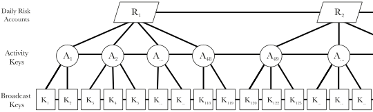

<figcaption>
The linked relationships between Daily Risk Accounts, Activity Keys, and
Broadcast Keys form a key hierarchy representing an individual user over time.
</figcaption>

All Activity Keys for a particular day are linked to the `DailyRiskAccount` for
that day using `LinkType::CONNECTION_LINK`. Similarly, all Broadcast Keys that a
user broadcasts during an `ActivityPeriod`, up to `MaxBroadcastKeys`, are linked
to the corresponding `ActivityKey`.

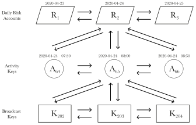

<figcaption>
An expanded view of the linked relationships around an individual's Activity Key
for the Activity Period 65.
</figcaption>

Since there's no fixed mapping of Broadcast Keys to Activity Keys, we only
establish the links between them after the fact. This can happen any time after
the Broadcast Key is first used, but must happen before that `ActivityPeriod` is
used for verification.

For honest participants, this will also serve as an activity "heartbeat". We can
use the difference in time between the corresponding `ActivityPeriod` and when
those Link Records are posted as a means of identifying periods when a user was
inactive, e.g. due to Bluetooth being turned off, phone being out of battery,
etc.

Each `ActivityKey` will have an associated `DeviceRecord` which will include a
commitment of `DeviceData` that is relevant to distance estimation, e.g.
Bluetooth transmit power level, etc.

```rust
type DeviceRecord {
    Commitment<DeviceData>
}
```

And, finally, all `Records` posted by an `ActivityKey` must be within an
`ActivityDeadline`, e.g. 2 days, so as to limit any caching/processing that must
be done by others when validating past activity.

### Trusted Authority

The start key of a user's Activity Key will be associated with an updateable
`TrustedAuthorityRecord`:

```rust
type TrustedAuthorityRecord {
    Authority
}
```

This will define a Local Authority or Government Authority that will define the
validity of Tokens received by the user, and that's acceptable to Verifiers from
other places based on the trust relationships between them.

The `TrustedAuthorityRecord` can only be updated to a different authority, e.g.
when a user permanently moves to a different country, if the new authority
explicitly trusts the previous one. Otherwise, the user will have to create a
fresh identity that is valid for that authority.

### Geo-Regions

The transmission of certain diseases is highly dependent on environmental
factors such as climate and population density. We use coarse-grained,
non-overlapping Geo-Regions as a rough approximation of this, e.g. London,
Alaska, Singapore, etc.

These will be represented as polylines of latitude/longitude co-ordinates and
will span in size from university campuses to entire countries. Users will be
able to manually select a Geo-Region or have it set automatically based on their
mobile device's GPS location.

When users travel, they should update their Geo-Regions to match the region used
by Verifiers in that location. Besides changing a setting on their local device,
this will also post a `CurrentRegionRecord`:

```rust
type CurrentRegionRecord {
    GeoRegion
}
```

This will be posted from the Key relating to their current Daily Risk Account,
and will be posted whenever a new Daily Risk Account becomes active or the
user's current Geo-Region changes.

The Geo-Region will also be reflected in some other aspects of the SafetyScore
protocol, such as when Contact Records are posted, SafetyScore calculations are
made, etc.

### Bluetooth Contact Detection

We do contact detection in a manner not too dissimilar to existing contact
tracing efforts. The main difference is that instead of broadcasting a random
ID, we broadcast data that includes cryptographic public keys, i.e. the
Broadcast Keys.

```rust
type BroadcastData {
    ActivityPeriod
    Altitude
    BroadcastKey
}
```

The `BroadcastData` includes the `Altitude` reading from the mobile device's
barometric pressure sensor. This will help us filter out potential false
positives when the Bluetooth signal goes through floors.

The `BroadcastData` is segmented over multiple BLE (Bluetooth Low Energy)
advertisement packets and will be updated when any of the values change, e.g.
when the Broadcast Key is rotated.

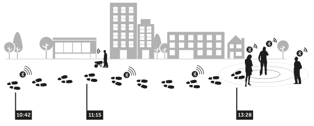

<figcaption>
Illustration of a user's journey as they interact with others.
</figcaption>

Devices will listen out for `BroadcastData` from other mobile devices and add
these to its local `ContactLog` with a timestamp and relevant `ProximityData`
for doing distance estimation, e.g. Bluetooth radio signal strength readings, if
it meets the following criteria:

* The received `ActivityPeriod` matches the local `ActivityPeriod`.

* The `BroadcastKey` hasn't been previously seen for a different
  `ActivityPeriod`.

* The received `Altitude` reading is within a reasonable threshold of the
  device's own reading.

Since the transmission of diseases will vary depending on whether someone is
indoors or outdoors, devices will also use the pattern of broadcast activity
around it to infer its `LocalEnvironment`:

```rust
enum LocalEnvironment {
    INDOORS
    INDOORS_CROWD
    OUTDOORS
    OUTDOORS_CROWD
    UNKNOWN
}
```

The inferred value is updated at regular intervals, e.g. every 5 minutes, and
stored in a local `EnvironmentLog` with the corresponding time window.

### Contact Establishment

For each entry in its `ContactLog` where a `BroadcastKey` has been seen for at
least `MinContactDuration`, e.g. 2 minutes, each party will try to detect those
that were close enough and establish a `ContactKey` for secure communications in
the future.

For every applicable `BroadcastKey`, each party will perform Elliptic-Curve
Diffie-Hellman using the corresponding Broadcast Keys it was using at that time.
Assuming they'd seen each other's Broadcast Keys, this will result in two
contacts arriving at the same `SharedSecret`.

Each party will then hash their `BroadcastKey` with the `SharedSecret` and then
run it through the BLAKE3 XOF (eXtensible Output Function) to derive a
`TemporaryContactKey` and `TemporaryEncryptionKey` to use to send a message to
the other party over the Distributed Ledger.

Using the `TemporaryContactKey`, they will then send a `ContactProof`:

```rust
type ContactProof {
    ActivityKey
    ContactData
    DeviceCommitmentBlind
    DeviceData
    LinkCommitmentBlind
    Signature
}
```

This will include:

* The `ActivityKey` corresponding to the `ActivityPeriod` when the contact
  happened.

* The `ContactData` including the `GeoRegion`, `LocalEnvironment`,
  `ProximityData`, and contact duration relating to the other party's
  `BroadcastKey`.

* The secret blind used to post the `DeviceRecord` associated with the
  `ActivityKey`.

* The raw `DeviceData` that includes the metadata to do accurate distance
  estimation.

* The `GeoRegion` the device thought it was in at the point of contact.

* The secret blind used to post the `LinkRecord` connecting the sender's
  `BroadcastKey` and `ActivityKey`

* The signature generated by the `ActivityKey` when signed over the other
  party's `BroadcastKey`.

The `ContactProof` will be encrypted using the `TemporaryEncryptionKey` and
posted as part of a `ContactProofRecord`:

```rust
type ContactProofRecord {
    Encrypted<ContactProof>
}
```

Since both parties can derive each other's `TemporaryContactKey` from the
`SharedSecret`, they can listen out for the appropriate `Entry` from the other
party over the Distributed Ledger.

Once the corresponding `ContactProof` from the other party has been seen, each
party will:

* Ensure both parties were in the same Geo-Region.

* Check that the signature over their `BroadcastKey` and the various commitment
  blinds are valid.

* Process the device and proximity data to determine if they were within
  `MaxProximityDistance`, e.g. 3 meters, of each other.

If all the information checks out, then the other party is considered a close
contact. Since close contacts might have seen each other using multiple
Broadcast Keys during the same `ActivityPeriod`, these are then aggregated
together for matching Activity Keys.

For every such `AggregatedContact`, each party will:

* Run both parties `ContactData` and distance estimation through a
  `ContactExposure` function. We do this as transmission isn't necessarily
  linear and will vary based on duration, proximity, and environment.

* Taking the resulting `ExposureLevel` value and store it in a local
  `ExposureLog` with a randomly generated `ContactKey` and `EncryptionKey` for
  the `ActivityPeriod` corresponding to that contact.

For contacts within the same `ActivityPeriod` with the highest Exposure Levels,
up to a `MaxContacts` limit, e.g. 30, each party will post a `ContactKeyRecord`
from any of the Temporary Contact Keys they'd already used for the other party:

```rust
type ContactKeyRecord {
    Encrypted<[ContactKey, EncryptionKey, ExposureLevel]>
}
```

As long as this is done within the `ContactEstablishmentDeadline`, e.g. 12 hours
from initial contact, both parties will have independent Contact Keys to use for
communicating with the other party in the future.

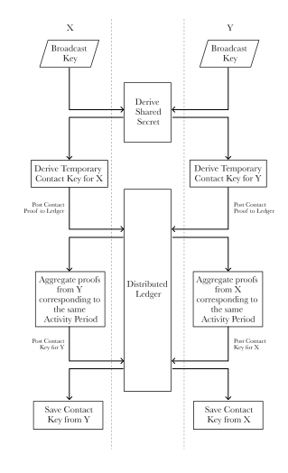

<figcaption>
The process for establishing Contact Keys between person X and person Y.
</figcaption>

Once contact has been established, a `ContactRecord` is posted by each party
using their `ActivityKey`:

```rust
type ContactRecord {
    Commitment<ActivityKey>
    GeoRegion
}
```

This commitment will be of the `ActivityKey` of the other party, and acts as a
public signal that a contact has been established. It also makes public the
Geo-Region of the contact for determining uptake.

### Distributed Notaries

Certain organizations will be able to run specialized Nodes that will act as a
Distributed Notary. These will perform similar roles to notaries in the real
world who act as witnesses and ensure that documents are properly executed.

Specifically, the Distributed Notaries will serve two key functions:

* They will provide signed verification of confidential information that has
  been proven to them, e.g. proof of non-adherence to protocol, relationships
  between entities, etc.

* They will act as a mint for Risk Tokens.

The right to operate a Distributed Notary will be limited to organizations that
have had a track record of working to preserve digital rights and freedoms, e.g.
the Electronic Frontier Foundation, Mozilla Foundation, Open Rights Group, etc.

We do this as the Distributed Notaries have access to certain confidential
information, such as the link between two Activity Keys, and the operators
should push back against subpoenas from parties looking to de-anonymize users.

The Distributed Notaries are represented by a set of threshold signature keys.
This gives us various benefits:

* No one party by itself can make any false attestations, and thus harm the
  integrity of the system.

* No one party will see all of the information pertaining to an individual as
  requests with confidential material will only be shared with distinct subsets
  of the Distributed Notaries.

* By being spread over independent jurisdictions, it will be difficult for any
  one jurisidiction to force the handover of confidential information, e.g.
  through the use of National Security Letters.

### Fraud Detection

If a contact doesn't follow protocol, then Clients can reach out to the
Distributed Notaries and present them with proof of protocol violation, e.g.
when a contact doesn't post a valid `ContactRecord` after establishing contact,
or their number of Contact Records exceeds `MaxContacts`, etc.

The Distributed Notaries can then check whether the claim is valid, and if so,
sign an attestation of Misbehavior for the misbehaving `ActivityKey`. This can
then be posted to the Distributed Ledger for everyone to see:

```rust
type MisbehaviorRecord {
    ActivityKey
    Reason
    Signature
}
```

These attestations factor into a user's `ActivityProfile`, and thus encourages
adherence to protocol, as misbehaving Client implementations will get penalized
and possibly even considered invalid — depending on the nature of the violation.

### Health Attestations

Certified Health Officials will be able to post `Records` to the Distributed
Ledger that attest to the health status of an individual. When an individual is
infected, a `PositiveTestRecord` is posted:

```rust
type PositiveTestRecord {
    ActivityPeriod
    Commitment<ActivityKey>
    Commitment<ActivityKeySignature<TestAuthorizationRequest>>
    GeoLocation
    InfectionStartDate
    InfectiousDisease
    RiskTokens
    TestMethod
}
```

The `InfectionStartDate` is derived from an estimate by the Health Official of
when the patient got infected. This must be within a time window that is
specific to each disease and is defined by a `MinInfectionPeriod` and
`MaxInfectionPeriod` range.

The estimate by the Health Official is automatically extended so as to enable
bi-directional contact tracing [^BAHLE20], i.e. cover those who might have
infected the individual, and not just those who the individual might have
infected.

The `GeoLocation` includes the Geo-Region as well as the latitude and longitude
of the Health Center, e.g. hospital, where the Health Official is based. This
data is made public so that researchers can track the spread of diseases over
time.

The `TestMethod` indicates the methodology used to arrive at the diagnosis:

```rust
enum TestMethod {
    CLINICAL_OBSERVATION
    NUCLEIC_ACID_AMPLIFICATION_TESTING
    SEROLOGICAL_TESTING
    ...
}
```

The `ActivityPeriod` reflects the time when the test was taken, or diagnosis
made if done through clinical observation. The Health Official will present the
patient with a `TestAuthorizationRequest`:

```rust
type TestAuthorizationRequest {
    ActivityPeriod
    CommitmentBlind
    InfectionStartDate
    InfectiousDisease
    HealthOfficialKey
    TestMethod
}
```

This can be presented over a QR code, and will include the diagnosis as well as
the public key for the Health Official, and the commitment blind that will be
used to obscure the `ActivityKey` and `ActivityKeySignature` in the
`PositiveTestRecord`.

The patient can then review the diagnosis and consent by sending an authorized
response:

```rust
type TestAuthorizationResponse {
    ActivityKey
    ActivityPeriodCommitmentBlind
    Authority
    AuthorityLinkProof
    DailyRiskAccounts
    DailyRiskAccountsCommitmentBlinds
    RiskTokenDepositEncryptionKeys
    Signature
}
```

This will include:

* Their `ActivityKey` corresponding to the `ActivityPeriod` specified in the
  `TestAuthorizationRequest`, and the commitment blind used for the `LinkRecord`
  between them.

* The user's trusted Local or Government `Authority`, and the proof that this is
  linked to the `ActivityKey` that they've shared.

* The Daily Risk Accounts for the period since the infection started, and the
  commitment blinds used for the `LinkRecord` between each of them and to the
  `ActivityKey`.

* The Encryption Keys used to deposit Risk Tokens within those Daily Risk
  Accounts.

* A signature over the hash of the `TestAuthorizationRequest` using the
  `ActivityKey`.

The Health Official can validate the response, anonymize the Risk Tokens so as
to only include the `Disease`, `ContactDegree`, and `ExposureLevel` for each of
them, and post the related `PositiveTestRecord`.

The sharing of the `RiskTokens` provides a mechanism for the system to learn how
effective it was at predicting the infection, and will be used to improve the
parameters used in various functions within the system.

Similarly, if an individual is healthy and tests negative for a particular
disease, then a `NegativeTestRecord` is posted:

```rust
type NegativeTestRecord {
    ActivityPeriod
    Commitment<ActivityKey>
    Commitment<ActivityKeySignature>
    GeoLocation
    Immunity
    InfectiousDisease
    RiskTokens
    TestMethod
}
```

This is generated in a manner similar to the `PositiveTestRecord`, except with
an `Immunity` field in place of the `InfectionStartDate` indicating if the
individual is currently thought to be immune:

```rust
enum Immunity {
    ANTIBODIES_PRESENT
    NONE
    VACCINATED
}
```

All records posted by a Health Official are publicly auditable, and can be used
by the corresponding Local or Government Authority to detect any anomalous
behavior by any of the Health Officials they have certified.

### Minting Of Risk Tokens

The posting of a `PositiveTestRecord` by a certified Health Official triggers
the minting and distribution of Risk Tokens. Distributed Notaries provide two
API methods relating to this process:

```go
interface API {
    CreateMintToken(CreateMintRequest) MintToken
    Mint(MintRequest) MintResponse
}
```

The `CreateMintToken` method is called by a Health Official with:

```rust
type CreateMintRequest {
    BlindedSerialNumber
    PositiveTestRecordReference
}
```

The Notary checks that the caller is a certified Health Official, validates the
parameters, e.g. ensuring that it hasn't been called for the same reference
previously, and creates a `MintToken` using the `BlindedSerialNumber` it has
been given.

Mint Tokens are similar in structure to Risk Tokens and will later be used to
mint corresponding Risk Tokens:

```rust
type MintToken {
    ContactDegree
    Date
    ExposureLevel
    InfectiousDisease
    IssuingAuthority
    SerialNumber
}
```

The only distinction is the inclusion of the `IssuingAuthority`, i.e. the Local
or Government Authority that authorized the Health Official, and thus acts as
the issuer for the resulting Risk Tokens.

The Serial Numbers are made up of two 32-byte components. The first half is just
a random 32-byte identifier generated by the caller, and the second half denotes
the public key of a caller who is authorized to call `Mint` with it.

Notaries sign these Serial Numbers with blind signatures so that it can be
anonymously passed from one contact to another. Once a Serial Number has been
used, i.e. as part of a call to `Mint`, it is marked as such and cannot be
re-used again.

The `MintToken` from the `CreateMintToken` will have `ContactDegree` set to
zero, `ExposureLevel` set to max, `InfectiousDisease` set to the one specified
in the `PositiveTestRecord`, and will use a `SerialNumber` authorized for the
infected individual, who, once they've received it, can then use it as part of a
`Mint` call.

For each source `MintToken`, the `Mint` call generates Mint Tokens to pass onto
the caller's contacts, as well as a `RiskToken` to be deposited in the caller's
Daily Risk Account. The call takes a `MintRequest` parameter:

```go
type MintRequest {
    Authority         AuthorityProof
    Issue             map[MintToken]IssueRequest
    RecentInfections  []RecentInfectionProof
    RecentImmunity    []RecentImmunityProof
}
```

Which includes:

* Proof of the individual's trusted `Authority`.

* The Mint Tokens that the individual had recently received, mapped to
  `IssueRequest` structures:

  ```go
  type IssueRequest {
      Contacts        map[Date][]BlindedSerialNumber
      DepositToken    BlindedSerialNumber
      ExposureLevel   int
      Nonce           []byte
  }
  ```

  This specifies:

  * A mapping of Blinded Serial Numbers for contacts that the resulting Mint
    Tokens should be distributed to, segmented by the dates the contact was
    made.

    This is only set if the `ContactDegree` of the source `MintToken` is less
    than the `MaxContactDegree`, e.g. 3, for the specified `InfectiousDisease`.

  * A `BlindedSerialNumber` to use to mint the `RiskToken` that will eventually
    be deposited into the caller's Daily Risk Account.

  * The `ExposureLevel` for the contact the `MintToken` was received from, or if
    it's from the Health Official to the infected individual, is automatically
    inferred to be the max level.

  * A 32-byte `Nonce` that will be signed by the Distributed Notaries as part of
    the response so as to prevent contacts from being passed multiple Mint
    Tokens from the same source token.

    This is only set if the `Contacts` map has any entries.

* Proof of any recent infections from `PositiveTestRecord` posts.

* Proof of any recent `Immunity` from `NegativeTestRecord` posts.

The `Mint` call will then validate the various inputs and, if appropriate,
generate a `MintResponse`:

```go
type MintResponse {
    Issue   map[MintToken]IssueResponse
}
```

This will include a `IssueResponse` for each of the input Mint Tokens:

```go
type IssueResponse {
    Contacts        map[Date][]MintIssue
    DepositToken    BlindedRiskToken
}
```

Which is, in turn, made up of:

* A `MintIssue` corresponding to each contact:

  ```go
  type MintIssue {
    Signature<[Nonce, BlindedMintTokenHash]>
    BlindedMintToken
  }
  ```

  This includes the `BlindedMintToken` that can be passed on by the caller to
  their contact, which will have the following fields altered from the source
  `MintToken`:

  * The `ContactDegree` incremented by one.

  * The `ExposureLevel` set to a factor of the source `MintToken` and the
    `ExposureLevel` specified in the request for that contact.

  The hash of this `BlindedMintToken` will be hashed together with the passed in
  `Nonce` and signed by the Distributed Notaries. This signature is then passed
  along as part of the `Distribution` from the caller to their contact.

* The `BlindedRiskToken` that should stripped of the blinding to derive the
  corresponding `RiskToken` which should then be deposited into the caller's
  Daily Risk Account.

  This `RiskToken` will have its `ExposureLevel` set to a factored value
  combining the value from the source `MintToken` together with the level
  specified in the `MintRequest` request.

  If the `MintToken` was received from a Health Officieal, i.e. the individual
  is infected, this deposit must take place in the individual's Daily Risk
  Account for the day corresponding to the `PositiveTestRecord`.

  Otherwise, the deposit must be in the Daily Risk Account corresponding to the
  `ActivityPeriod` of the received `MintToken`.

### Distribution Of Risk Tokens

Risk Tokens flow from an infected individual to all of their contacts since
`InfectionStartDate`, and from each of them to all the contacts they've had
since, and so on.

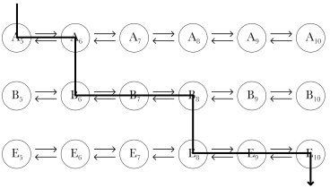

<figcaption>
The distribution of Risk Tokens from individuals A to B to E, based on the past
contact between them.
</figcaption>

The infected individual starts out with a `RiskToken` with `ContactDegree` of
zero, and its keeps getting passed along until it reaches a `MaxContactDegree`
threshold, e.g. 3.

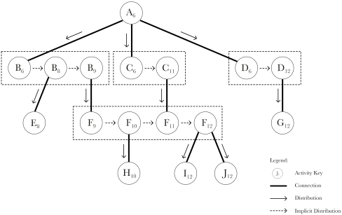

<figcaption>
The distribution of Risk Tokens over the network of interactions stemming from
an infected individual.
</figcaption>

The distribution is triggered by the sending of a `DistributionStart` message by
the Health Official:

```rust
type DistributionStart {
    MintToken
    PositiveTestRecordReference
}
```

This message is sent by posting a `DistributionStartRecord` to the Distributed
Ledger from an `OfficialContactKey` and encrypted with a corresponding
`EncryptionKey`:

```rust
type DistributionStartRecord {
    Encrypted<DistributionStart>
}
```

These keys are derived from the `SharedSecret` resulting from Elliptic-Curve
Diffie-Hellman on the Health Official's Key and the `ActivityKey` of the
infected individual that was shared as part of the `PositiveTestRecord`.

The `DistributionStart` includes a reference to the corresponding
`PositiveTestRecord`, and the initial `MintToken` authorized by the Health
Official by making a call to `CreateMintToken` to the Distributed Notaries.

The infected individual will then make a `Mint` call to the Distributed
Notaries, with the received `MintToken`, deposit the resulting `RiskToken` into
their `DailyRiskAccount`, and send on the resulting Mint Tokens to all of their
contacts since the `InfectionStartDate`.

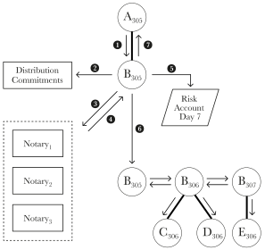

<figcaption>
Illustration of the distribution process.
</figcaption>

Each contact runs through the following process for distributing Risk Tokens:

1. They receive a `DistributionRecord` from an "upsteam" contact using a
   previously established `ContactKey` and corresponding `EncryptionKey`:

   ```rust
   type DistributionRecord {
       Encrypted<Distribution>
   }
   ```

   The included `Distribution` will contain a `BlindedMintToken` reflecting the
   `ExposureLevel` of the previous contact, and will have its `SerialNumber`
   suffixed with the `ContactKey` of the recipient authorizing further minting.

   ```rust
   type Distribution {
       DistributionKey
       BlindedMintToken
       BlindingFactor
       MintSignature
       Nonce
       Signature
   }
   ```

   The recipient can check the `MintSignature` from the Distributed Notaries
   over the hash of the `BlindedMintToken` together with the `Nonce` to validate
   the Token before converting it into a `MintToken` by stripping the
   `BlindingFactor`.

   The `Distribution` will also have a `Signature` over the recipient's
   `ContactKey` from a unique `DistributionKey` that identifies related
   Distributions sent by the upstream contact across their various Contact Keys.

   If the `Date` on the received `MintToken` exceeds the `MaxDistributionPeriod`
   for the corresponding `InfectiousDisease`, then the receiver can end the
   process after validating the `Distribution` data

2. They collate together all Distributions received from the same individual,
   i.e. using the same `DistributionKey`, and make Distribution Commitments
   using each of the corresponding Daily Risk Accounts.

   This will be posted as a `DistributionCommitmentRecord` using a pre-generated
   `EncryptionKey` for each `DailyRiskAccount`:

   ```rust
   type DistributionCommitmentRecord {
       Encrypted<DistributionCommitment>
   }
   ```

   Each `DistributionCommitment` will reflect the receiver's intent to do a
   follow-on `Distribution` to their contacts. This will specify the
   `StartPeriod` and the `ExcludedPeriods`:

   ```rust
   type DistributionCommitment {
       ExcludedPeriods
       StartPeriod
       SignatureHash
   }
   ```

   We specify `ExcludedPeriods` as we don't redistribute in the same Activity
   Periods as Distributions were received, so as to minimize Distributions from
   flowing back to the same upstream contact, e.g. via a mutual contact in the
   same `ActivityPeriod`.

   The included `SignatureHash` is the hash of the `Signature` received in the
   first `Distribution` containing the same `DistributionKey` received on the
   day corresponding to a particular Daily Risk Account.

   These Distribution Commitments can later be used as verifiable evidence if
   the receiver fails to honestly pass on Distributions to others.

3. They call the `Mint` API method on Distributed Notaries using the Mint Tokens
   they'd received within `MintWindow`, e.g. 3 hours.

   When the `ContactDegree` is less than the `MaxContactDegree`, they build the
   `Contacts` for the `MintRequest` parameter by:

   * Collating together all the contacts they've had in the Activity Periods
     since the `InfectionStartDate` for a zero-degree `MintToken`.

   * Collating together all the contacts they've had in the Activity Periods
     since the `ActivityPeriod` corresponding to the `ContactKey` of the
     `Distribution` — excluding contacts in any Activity Periods where the same
     `DistributionKey` was received.

4. They process the response from the Distributed Notaries. This will include
   the `RiskToken` for them to deposit as well as the Blinded Mint Tokens for
   them to distribute to their contacts.

5. They deposit the `RiskToken` that was returned from the `Mint` call to the
   appropriate `DailRiskAccount`. This is done using a `DepositRecord` and using
   the key of the `DailyRiskAccount` and a generated `EncryptionKey`:

   ```rust
   type DepositRecord {
       Encrypted<RiskToken>
       EncryptionKeyHash
   }
   ```

6. For each of the contacts they will be redistributing to, they prepare a
   `Distribution` with a new randomly generated `DistributionKey` and include
   the corresponding `BlindedMintToken` and related fields.

   For each contact, the distributor will verify that the downstream contact had
   followed protocol by waiting for a `DistributionProofRecord` from them and
   validating the resulting data.

   A delay of up to `DistributionDeadline`, e.g. 12 hours, will be allowed for
   this, as mobile devices might be out of charge/reception while people are
   sleeping/traveling.

   If the downstream contact fails to provide proof, the sender will reveal the
   breaking of protocol to the Distributed Notaries by sharing their Contact
   Proof and Distribution Records, resulting in a `MisbehaviorRecord` being
   attached to the `ActivityKey` of the downstream contact.

7. They provide proofs to the upstream contact that they'd followed protocol by
   posting a `DistributionProofRecord`:

   ```rust
   type DistributionProofRecord {
       Encrypted<[]DistributionProof>
   }
   ```

   The included `DistributionProof` reveals the connection between their
   `ActivityKey` and their `DailyRiskAccount`, the `EncryptionKey` used to make
   the deposit, and the `EncryptionKey` used to make all the Distribution
   Commitments for that `DailyRiskAccount`.

   ```rust
   type DistributionProof {
       ActivityKeyCommitmentBlind
       DailyRiskAccount
       DepositEncryptionKey
       DepositReference
       DistributionCommitmentEncryptionKey
       RelatedContactKeys
       RelatedSignature
   }
   ```

   If related Distributions were received over multiple Contact Keys, then the
   related Distribution Proofs are all aggregated into one for each day, and
   sent from the very first `ContactKey` it was received, and will include the
   `RelatedContactKeys` and a joint signature from all of them.

   The upstream contact can use the provided `DistributionProof` to ensure that
   the receiver had converted the `BlindedMintToken` passed to them into a
   `RiskToken`, that this had been deposited into the right `DailyRiskAccount`,
   and that they'd made the appropriate `DistributionCommitment`.

   They can also check for any other Distribution Commitments that are present,
   and check that they'd received any applicable Distributions relating to them,
   and thus ensure that the contact was passing on Risk Tokens it had received.

The distribution of Risk Tokens is only to existing contacts at the time a
`Distribution` is received, and is not propagated to future contacts. This
ensures that:

* Certain classes of attacks aren't as feasible, e.g. stealing the mobile device
  of an infected individual to cause havoc at the local gym by setting off a
  "Risk Bomb" and making everyone in the gym think they're at risk.

* Infected individuals aren't turned into social pariahs as they walk down the
  street, as others would notice their scores go down soon after.

### SafetyScore Calculation

Everyone starts out with a SafetyScore of zero, and gradually builds it up
through interactions with the system. An individual's SafetyScore is calculated
by running the `Aggregation` function over the following parameters:

* The `RiskProfile` generated by running the Risk Token in the Daily Risk
  Accounts through the `RiskDistribution` function. This is done for up to
  `RiskProfileDays` days, e.g. 28 days, and represents the risk of the
  individual being infectious for various diseases.

* Any Negative Test Records within the `NegativeTestWindow`, e.g. a year. Any
  recent tests with a positive `Immunity` field will be given greater weighting,
  depending on the `Disease`.

* The `ActivityProfile` of the individual reflecting the number of Contact,
  Misbehavior, and Verified Records that are associated with every `ActivityKey`
  for `ActivityProfileDays`, e.g. 45 days.

  Together with the Link Records linking the `ActivityKey` to Broadcast Keys,
  these provide an activity pattern for the individual that can be used to
  weight risks based on mobility and penalize anomalous behavior.

* Geo-Regions associated with Contact Records, Daily Risk Accounts, and the
  current Geo-Region. These determines the manner in which the elements of the
  `ActivityProfile` and `RiskProfile` are interpreted.

* The `Authority` trusted by the user so that Verifiers can check if it's an
  Authority that is trusted by their trusted Authority.

The function inverts a calculated `RiskScore` to generate a SafetyScore value
between 0 and 99. We do this as most people tend to perceive a bigger number to
be better.

The resulting SafetyScore is also returned as an integer so as to reduce the
precision and thus make it difficult to track an individual over time.


<figcaption>
The various inputs to the Aggregation function.
</figcaption>

The `Aggregation` function can be run locally on a user's device, but since this
is unlikely to be trusted by everyone, it can also be executed and signed by
Distributed Notaries so as to provide an attestation of someone's SafetyScore:

```rust
type SignedSafetyScore {
    ActivityKey
    ActivityPeriod
    Authority
    GeoRegion
    Score
    Signature
}
```

This can be done by iteratively building up the parameters by revealing certain
information to Distributed Notaries. Each of these steps are done with distinct
subsets of the Notaries, so that no single one of them is privy to all of it:

* To prove that two Activity Keys are connected with a forward and backward link
  between each other and to a specific `ActivityPeriod`, the Client can share
  the commitment blinds that were used for the corresponding Link Records.

  Notaries can certify that the pair of Activity Keys are connected, and this
  can in turn be used to prove a whole connected chain to other Notaries.

* The current `Authority` associated with the start key of the user's Activity
  Key through the `TrustedAuthorityRecord` can thus also be proved to a Notary.

* A similar process can be used to prove that a chain of Daily Risk Accounts are
  all connected, and that a specific `ActivityKey` and `DailyRiskAccount` are
  connected.

* By revealing the `ActivityKeyCommitment` of a `NegativeTestRecord`, the
  corresponding `ActivityKey` can be proven to Notaries. This can then be
  associated to a chain of Activity Keys.

* For each `ActivityKey`, the Notaries can be asked to attest to a partial
  `ActivityProfile` at a specific point in time by simply looking at the
  corresponding records on the Distributed Ledger.

  These partial attestations can then be combined into a complete
  `ActivityProfile` for the chain of Activity Keys.

* Similarly, the Encryption Keys used to deposit Risk Tokens for a specific
  `DailyRiskAccount` can be shared with Notaries along with the Current Region
  Records so as to get them to attest to a partial `RiskProfile` for that
  particular day for a specific count of deposits.

  These partial attestations can then be combined into a complete `RiskProfile`
  for the chain of Daily Risk Accounts.

The various parameters then go through a processing step which strips out the
corresponding Keys through blinding, and this is then passed to a subset of the
Notaries who execute the `Aggregation` function and provide the individual with
the resulting `SignedSafetyScore`.

The code for the `Aggregation` function will be frequently updated based on
improved modeling, scientific data, and SafetyScore activity.

### Verification

During epidemics, it's likely that certain premises will safeguard premises by
verifying that someone's SafetyScore meets a necessary `SafetyLevel` before
letting them in.

To do this, Verifiers will need to run a light Client and generate a random
`VerifierKey`. Those wishing to be verified can then present them with some
initial data, e.g. as a scannable QR code:

```rust
type VerificationStart {
    AuthToken
    BroadcastKey
}
```

This will be comprised of a randomly generated `AuthToken` for that verification
and the user's current `BroadcastKey`. The Verifier can then perform
Elliptic-Curve Diffie-Hellman between their Key and the given `BroadcastKey` to
derive a `SharedSecret`.

This `SharedSecret` can then be run through the BLAKE3 XOF (eXtensible Output
Function) to derive a `VerifierEncryptionKey`. The Verifier can then scan for
the `BroadcastKey` and connect to that device, e.g. over Bluetooth, and send:

```rust
type VerificationRequest {
    BroadcastKey
    VerifierKey
    Encrypted<[AuthToken, ChallengeToken]>
}
```

This will include a randomly generated `ChallengeToken` specifically for that
request.

The Client on the device of the user being verified will listen out for such
requests, use the `VerifierKey` to derive the `VerifierEncryptionKey`, check
that the `AuthToken` is valid, and generate an `Entry` for the Distributed
Ledger with a `VerifiedRecord` value:

```rust
type VerifiedRecord {
    Commitment<ChallengeToken>
}
```

The commitment for the `VerifiedRecord` will be of the `ChallengeToken` that was
given to it by the Verifier. The `Entry` with the Record will be signed by the
user's `ActivityKey` for that `ActivityPeriod`.

The device can then send back the `VerificationResponse`, encrypted using the
previously derived `VerifierEncryptionKey`:

```rust
type VerificationResponse {
    ActivityKey
    ActivityPeriod
    ActivityPeriodCommitmentBlind
    BroadcastKeyCommitmentBlind
    Entry<VerifiedRecord>
    SignedSafetyScore
    VerifiedRecordCommitmentBlind
}
```

This will allow the Verifier to validate a number of factors:

* They can check that the given `BroadcastKeyCommitmentBlind` matches the
  commitment made on the Link Records between the initial `BroadcastKey` and the
  given `ActivityKey`.

* They can check that the given `ActivityPeriodCommitmentBlind` matches the
  commitment made on the Link Record between the given `ActivityKey` and the
  given `ActivityPeriod`.

* They can check that the `ActivityPeriod` is the same as theirs, or if close to
  the time when Activity Periods change, then either the previous or next one.

* They can check that the `VerifiedRecordCommitmentBlind` matches the given
  `VerifiedRecord` for the `ChallengeToken` they provided, and that the `Entry`
  has a valid signature from the given `ActivityKey`.

  The `VerifiedRecord` is then later posted by the Verifier to the Distributed
  Ledger. This will feed into the user's `ActivityProfile` and acts as a
  safeguard against the same profile being used by lots of people, as it will
  show up as an anomaly when they're repeatedly verified multiple times in quick
  succession.

* They can check that the given `SignedSafetyScore` is for the given
  `ActivityKey`, matches the Geo-Region of the Verifier, is for an `Authority`
  that is trusted by the Verifier's trusted `Authority`, that it was certified
  by the Distributed Notaries, and meets the necessary `SafetyLevel`.

Once verified, the individual can be granted access. We may modify this sequence
so that the user doesn't have to be connected for up to `MaxOfflinePeriod`, e.g.
2 hours, and could thus work in areas without mobile data reception.

### Government Authorities

Government Authorities can represent cities, states, and countries. They have a
hierarchical relationship reflecting existing political structures and encompass
specific geo-regions.

The Government Authorities are represented by a set of threshold signature keys,
and their function is to:

* Add Health Officials. This is done by them posting a `AddhealthOfficialRecord`
  referencing the public key of the corresponding official.

* Remove Health Officials. This is done by them posting a
  `RemoveHealthOfficialRecord` referencing the public key of the corresponding
  official, e.g. when someone retires, or has their credentials stolen.

* Send Notification Messages. This is done through the use of Notification
  Records described in the section below.

* Update the Safety Level. This is done by them posting a `SafetyLevelRecord`
  for a particular Geo-Region and will define the SafetyScore that Verifiers
  will need to see in order to let individuals into premises within that
  Geo-Region. These records will have an expiry time and will default to `50` if
  no value has been explicitly set.

All actions of a Government Authority will be public and can be reviewed by
others by simply looking at the `Records` posted to the Distributed Ledger.

### Notifications

Government Authorities can send notifications to users by posting Notification
Records to the Distributed Ledger:

```rust
type NotificationRecord {
    Constraints
    Image
    Message
}
```

These could be used for making health-related public announcements, as well as
to let those with low SafetyScores to come in for fast-tracked testing or manual
contact tracing.

The `Constraints` can specify which users a particular message applies to, e.g.
it could be constrained to those within specific Geo-Regions, those with
SafetyScores below a certain level, etc.

Each notification could also have an `Image` that can be displayed next to the
message so as to create a better user experience. This will be the hash of an
`ImageRecord` that has been previously posted — so that the Distributed Ledger
isn't filled up by duplicate image data.

```rust
type ImageRecord {
    Data
}
```

Clients can interpret these Notification Records and only display those that are
pertinent to a user based on their local data. And through the use of a trusted
server, they could even be presented as push notifications to a user's mobile
device.

### Local Authorities

Local communities like university campuses can adopt SafetyScore before it's
rolled out by their government. They can do this by setting up a validated Local
Authority for a specific Geo-Region.

These Local Authorities are represented by a set of threshold signature keys,
and they can add/remove Health Officials, trust other Authorities, and set
Safety Levels similar to Government Authorities.

Unlike with Government Authorities where trust is binary, trust by Local
Authorities is evaluated using attack-resistant trust metrics [^Lev04] —
allowing for a network of Local Authorities to grow over time.

### Root Authority

We introduce a single element of centralization into the protocol to act as the
trusted Root Authority for privileged participants like Government Authorities,
Local Authorities, and the Distributed Notaries.

The Root Authority will be represented by a set of threshold signature keys, and
its function is to:

* Add/Remove/Update Government Authorities. This is done by posting the
  corresponding `AddGovAuthorityRecord`, `RemoveGovAuthorityRecord`, or
  `UpdateGovAuthorityRecord`. These associate specific Geo-Regions with the
  threshold signature keys for the corresponding Government Authority.

  We've set up a non-profit called "Broad Street Pump Foundation" to perform
  this function. We hope the transparency and accountability that this brings
  will help drive adoption around the globe.

* Add/Remove/Update Local Authorities. This is done by posting the corresponding
  `AddLocalAuthorityRecord`, `RemoveLocalAuthorityRecord`, or
  `UpdateLocalAuthorityRecord`. These associate specific Geo-Regions with the
  threshold signature keys for the corresponding Local Authority.

* Define Functions. There are a number of elements within the protocol such as
  the `ContactExposure`, `RiskAggregation`, and `RiskDistribution` functions
  that are specific to diseases or Geo-Regions. These need to be updated as our
  understanding evolves based on scientific data.

  The Root Authority can update these definitions by posting Function Records
  with the corresponding WASM (WebAssembly) code for the specific functions.
  Where these functions are specific to Geo-Regions, the Root Authority may
  delegate the definition to the corresponding Government Authority.

* Define Global Parameters. There are certain global parameters such as the
  `MinInfectionPeriod` for a disease which will need to be updated based on our
  scientific understanding. The Root Authority can update these definitions by
  posting Parameter Records with the latest values for these parameters.

* Specify Geo-Regions. This is done by posting a `GeoRegionsRecord` with the set
  of added/removed regions and their corresponding polyline definitions.

* Add/Remove Distributed Notaries. This is done by posting the `NotariesRecord`
  with the security parameters and keys for the Distributed Notaries.

Like with Government Authorities, all actions of the Root Authority will be
public and can be reviewed by others by simply looking at the `Records` posted
to the Distributed Ledger.

### Transport Layer

We will use the Noise Protocol Framework [^Per18] as the transport layer between
Clients, Nodes, and Notaries. It provides us with low latency, end-to-end
encryption with forward secrecy and identity hiding.

Noise is currently used by projects like WhatsApp and I2P, and omits many of the
features that have resulted in security flaws in related protocols like TLS.

### RPC Layer

We will layer an RPC (Remote Procedure Call) mechanism on top of the transport
layer for requests between Clients, Nodes, and Notaries. This will be
functionally similar to gRPC [^grpc] with some useful aspects from Cap’n Proto
RPC [^capnproto-rpc].

### Proof of Work

Certain elements of the SafetyScore protocol will require a computationally
intensive cryptographic puzzle to be first solved:

* When an `Entry` is posted to the Distributed Ledger.

* When an RPC call is made by a Client.

This "proof of work" [^Bac02] will be computed using the Argon2 [^BDK15]
memory-hard hash function and will serve as a layer of defence against resource
exhaustion attacks against the system.

Nodes will temporarily keep track of the IP addresses that have sent them
requests, and will rapidly increase the "hardness" of the computations if
requests from the same IP address exceeds a base rate limit.

Clients will thus not be able to easily flood the Distributed Ledger with random
data, and it will prove costly for them to maintain lots of fake identities over
long periods of time.

### Trusted Nodes

As it would be unrealistic for most users to run full Nodes on their mobile
devices, we expect most Clients to be "light clients". That is, they will use a
set of trusted Nodes for:

* Discovering the IP addresses and public keys of other Nodes.

* Discovering the verified hashes of Blocks on the Distributed Ledger.

With just these two pieces of information, Clients could communicate with other
Nodes — even if they are not trusted — and verify everything else for
themselves.

We will run a public Node for others to use at `node.safetyscore.app`, but in an
ideal world everyone would run their own.

### Delayed Publishing

Since most of the protocol is not sensitive to delays, Clients should add random
delays when publishing to the Distributed Ledger from different keys so as to
make it harder for third-party observers to correlate related activity. 

### Request Segmentation

Since Nodes will be able to see the IP addresses of Clients, they could use this
to correlate activity from distinct keys as belonging to the same person or a
set of people.

To prevent such correlation, it would be ideal if Clients would either use Tor
[^tor] or configure the use of a “fully trusted” personal Node for all RPC calls
that might lead to such correlation. Unfortunately, this is unrealistic to
expect from most users.

We therefore resort to request segmentation as the default configuration. That
is, Clients will send calls to a unique Node for each key. And, to the greatest
extent possible, Clients will keep re-using that same Node for all requests
relating to that specific key.

Since attackers could easily run lots of virtual Nodes on the same hardware, we
will use relative latency measurements amongst Nodes to determine the network
topology.

Clients will use this to pick Nodes which are far apart from each other. Thus
attackers would have to actually run Nodes on distinct hardware in multiple
locations — making it relatively expensive for them to observe and correlate
user activity.

### Anonymized Relaying

While the use of a personal Node would mask the IP address of a user from the
rest of the network, if the same Node was always used for publishing to the
Distributed Ledger, then observers could use it to correlate distinct keys as
belonging to the same set of people.

To defend against such attacks, we use the techniques from Dandelion++
[^FVB+18], which is somewhat similar to the work we’ve done on Freenet [^CSWH00]
in the past.

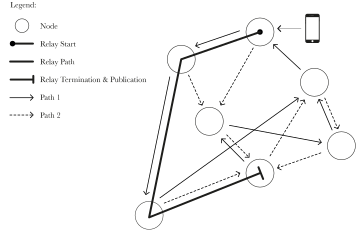

<figcaption>
The path taken by a Publish call.
</figcaption>

Every `PublishInterval`, e.g. 10 minutes, each Node will deterministically place
itself into one of two modes:

* *Publish Mode.* In this mode, the Node will directly handle a Publish call and
  publish an `Entry` to the Distributed Ledger.

* *Relay Mode.* In this mode, the Node will forward Publish calls to one of two
  random Nodes it has selected for that `PublishInterval`.

If the Node is the entry point for a Publish call, then it will always act in
relay mode. And if a relayed call doesn’t result in a published `Entry` within a
given deadline, Nodes will publish it directly themselves.

With this fairly simple approach, we can effectively mask the origin point from
the rest of the network and help protect users. We use a similar mechanism for
RPC requests to mask Client IP addresses from the Distributed Notaries.

### Time Considerations

All calculations relating to dates and time will be done in TAI (International
Atomic Time). This allows us to keep these calculations simple and avoid the
complexities of leap seconds and changing time zone definitions.

To minimize errors caused by clock skew, Clients will use an RPC method that
will mirror the Roughtime synchronization protocol [^MLL20]. For time
synchronization amongst Nodes, we will also incorporate ideas from Huygens
[^GLY+18].

## Distributed Ledger

The Distributed Ledger acts as a high-integrity, shared database without a
central point of control. We provide a high-level overview of its architecture
below.

### Consensus Algorithm

Since some elements of our protocol require us to be able to establish a global
ordering across Entries, we use a design similar to blockchains [^Cha82a]
[^Nak08] instead of using one based on DHTs (Distributed Hash Tables) [^BRS20].

The distributed consensus algorithm for establishing this global ordering needs
to be:

* *Scalable.* With potentially billions of users using SafetyScore, and making
  regular updates, the network needs to be able to support high throughput. Not
  quite on the level of Google or Facebook, but still considerably higher than
  the low throughputs of existing proof-of-work and proof-of-stake systems.

* *Byzantine Fault Tolerant.* That is, it should be tolerant to faulty or
  malicious parties running Nodes within the network [^LSP82].

* *Permissionless.* That is, anyone should be able to start running a Node
  without having to need approval from a centralized party.

* *Accessible.* Following on from the previous point, people should be able to
  run Nodes and contribute to the network without needing to have million-dollar
  servers.

We believe that we have a viable consensus algorithm called Kairos that can
satisfy these requirements.

In it, each Node generates its own sequence of Blocks, and collectively the
Blocks from all Nodes form a DAG (Directed Acyclic Graph) which acts as the
underlying representation of the Distributed Ledger.

### Validators

Nodes that can validate Blocks that have been published to the Distributed
Ledger are known as Validator Nodes. This right is gradually earned by Nodes
based on:

* *Availability.* Validators should be highly available and operate with minimal
  downtime.

* *Reliability.* Validators should be reliable in storing and serving the data
  that has been published to the Distributed Ledger.

* *Distance.* Validators should be as far away from each other as possible so as
  to increase the overall resilience of the network.

Every `DiffusionInterval`, e.g. every week, a `DiffusionPortion`, e.g. 2%, of
the `ValidatorRights` of existing Validator Nodes “diffuses” to other Nodes
based on the three factors above.

New Nodes can thus become Validator Nodes by simply operating reliably. The
earned `ValidatorRights` decay over time if a Validator Node becomes inactive —
enabling the continued functioning of the Distributed Ledger despite the
inevitable churn of active Nodes.

### Kairos

Kairos is a simple algorithm for achieving distributed consensus in a Byzantine
fault-tolerant manner. It enables the production of a globally-consistent,
totally-ordered log which forms the foundation of our Distributed Ledger.

There are a few global parameters which define the authenticity and block
generation capacity of the network:

* `SeedValidators` — the IDs and public keys for the initial set of Validator
  Nodes that are used to bootstrap the network.

* `TickInterval` — the interval at which Nodes produce new `Blocks`, e.g. every
  second.

* `Epoch` — the date and time of the zeroth tick, e.g. midnight on July 1st
  2020.

* `CommitWindow` — the deadline by which a `Block` can be marked as committed,
  e.g. within 5 ticks.

* `MaxEntriesSize` — the block size limit for the `Entries` data, e.g. 100MB.

The network is able to tolerate up to `f` byzantine Validator Nodes as long as
there are `2f+1` honest Validator Nodes.

### Block Generation

For every `TickInterval`, each Node can produce a `Block` comprised of `Entries`
submitted to it by users, as well as `BlockReferences` to its previous `Block`
and Blocks produced by other Nodes.

```rust
type Block {
    BlockReferences
    Entries
    NodeID
    Signature
    Timestamp
}
```

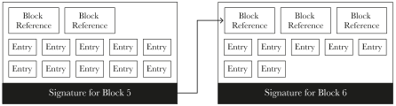

<figcaption>
Illustration of how a Node's Block feeds into its next one.
</figcaption>

The `Block` headers will be arranged in such a way so that Clients can verify
that an `Entry` is present without having to download the whole `Block`. This
will be done with the aid of verified streaming that BLAKE3 provides.

The `BlockReferences` include the key metadata fields relating to a `Block` as
well as the first level of direct `BlockReferences` included in the referenced
`Block`:

```rust
type BlockReference {
    BlockHash
    BlockNumber
    DirectReferences
    NodeID
    Signature
    Tick
}
```

Nodes will only include a `BlockReference` after it has validated a `Block` and
seen all the Blocks that it has referenced — creating a DAG of the Blocks from
the perspective of each Node.

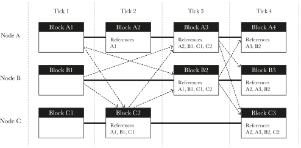

<figcaption>
Illustration of the Block DAG showing 3 different Nodes producing and
referencing Blocks over 4 ticks.
</figcaption>

Once a `Block` has been generated, it is then broadcast to the other Nodes in
the network. Blocks are only generated if there is any data that needs to be
communicated with the rest of the network.

### Block Commit

The `Entries` for a `Block` are only considered to be valid once they've been
"committed". To reach this state, the `Block` must be seen, i.e. included as a
`BlockReference`, by at least `2f+1` Validator Nodes within the defined
`CommitWindow`.

All committed Blocks form a `MetaBlock` which is defined by taking the hash of
the lexicographically ordered hashes of each committed `Block`, and hashing it
with each of those Blocks, to arrive at a sorted final order for the committed
Blocks.

The `Entries` for a tick are then fully ordered, first by the position of the
`Block` within the `MetaBlock`, and then by the position of the `Entry` within
that `Block`.

### Handling Misbehavior

It's possible for Nodes to misbehave in a number of ways. This can be due to
either malice or getting hacked in some way, e.g. by having their signing keys
stolen.

When generating Blocks, Nodes can include evidence of `NodeMisbehavior`, e.g.
when receiving differing signed Blocks for the same tick. Once this has been
seen by `2f+1` Validator Nodes, all new Blocks by that Node are ignored until it
generates a new signing key by using it's secret `RevocationKey`.

### Implementation

We implemented and helped validate Blockmania [^DH18], a related DAG-based
consensus algorithm, that was able to handle over 400k transactions per second
over a wide area network, and will use this to inform the implementation of
Kairos.

## Active Considerations

There are certain aspects of our design that we're still deliberating. We
elaborate on some of these below and will have them finalized by the time we
release the initial Protocol Specification.

### Self-Attestations

There could be a lot of value in letting users directly attest that they’re
experiencing symptoms. This could be useful — especially in regions where there
isn’t much testing capacity, or for new diseases where there’s no established
testing process.

Unfortunately, this also opens up opportunities for malicious parties to cause
potential panic by making false attestations. The situation is made worse by the
potential for Sybil attacks [^Dou02].

We believe this could be addressed by adding an additional field on Risk Tokens
to demarcate them as stemming from self-attestations. These could have a
significantly lower weighting and could only be “valid” if a particular
`DailyRiskAccount` also contains Risk Tokens stemming from Health Officials.

It could also be further tweaked by the `Aggregation` function depending on the
Geo-Region — reflecting the current testing capacity for that area. Through
these means, we believe that self-attestations could be potentially added to the
protocol, and allow for better data quality.

### RSSI Calibration

Distance estimation for proximity detection is done by looking at the RSSI
(Received Signal Strength Indicator) reading on Bluetooth. The higher the RSSI,
the stronger the signal, and this serves as a proxy for estimating the relative
distance between devices.

Unfortunately, RSSI is a relative measurement that is mostly defined by each
chipset manufacturer and different device models transmit at different power
levels. We thus need to calibrate device models for maximal effectiveness.

This requires broad-enough testing so as to identify the calibration data for
the full range of mobile devices that are used by the public. Thankfully, the
BlueTrace project has already started an open source repository for this data
[^calibration], and we look forward to contributing to it.

We can also improve the confidence of our distance estimation by doing
statistical analysis over multiple RSSI readings of a `BroadcastKey` instead of
relying on just a single reading.

### Bluetooth Background Execution

In order to conserve battery use and minimize security issues, iOS and recent
versions of Android limit Bluetooth activity when an app is in the background or
when the device is locked — resulting in Broadcast Keys being potentially
missed.

Given Apple and Google's willingness to make changes to the base OS in response
to the pandemic, and their support of decentralized systems, we're hopeful in
being able to have a productive conversation with them on this matter.

In the meantime, the high levels of smartphone addiction, i.e. people's tendency
to check their phones on a regular basis, works in our favour, and we can use
techniques like keep-alive connections to wake up sleeping devices.

### Fairness

If SafetyScore is used to safeguard access to spaces like restaurants and bars
during epidemics, then frontline workers such as healthcare workers and bus
drivers will inevitably find themselves denied access to such spaces.

While this accurately reflects the risk they pose, there is an open question of
whether this is fair given the extraordinary risk those individuals are taking
on a day-to-day basis.

We believe that this should be addressed by governments at the policy level,
perhaps through increased compensation for frontline staff or by allowing
greater freedom for those who can prove that they’re in a job that takes
precautions.

Similarly, there might be particularly vulnerable segments of society such as
the elderly who should not be denied access to basic amenities even if they have
a low SafetyScore.

We could explicitly add support for both of these cases through an
`ExemptionRecord` which Government Authorities could post. This could have an
encrypted `LegalName` field that Verifiers could check against some form of
recognized photo ID.

### Fomite Detection

Surfaces can be a major vector in the transmission of infectious diseases. There
could be specific sites acting as a persistent source of infection, e.g. a
public toilet at a service station.

To help identify such sites, it might be worth extending the protocol so that
Verifiers get notified of an infection via a `VerifierNotificationKey`
established through key agreement when an individual verifies themselves.

Since the Verifier would know the SafetyScore of the individual they’d verified,
if a significant number of people keep getting infected soon after passing
through a specific site, it might suggest sanitary issues at that particular
location.

Verifiers could register their location with a government-specific database and
on notification of infections, provide the date and SafetyScore they’d seen for
the now infected individual.

Contact tracing teams at the particular government could then use this data to
conduct further investigations, and possibly even send in units to help
decontaminate any at-risk sites.

If we do decide to add support for such functionality within the protocol, we
would do it in a way that maintains the existing privacy-preserving properties
for users.

### Cover Traffic

While the contents of the data that is communicated across the network is
protected by the Transport Layer security, observers at the network level would
still be able to see that certain actions have happened, e.g. when activity
spikes when Risk Tokens are distributed.

To protect against this, it could be useful to have cover traffic between
Clients and Nodes, and even between Nodes. We’re evaluating using some aspects
from Loopix [^PHEMD17] to maximize the anonymity and unobservability of Clients
and Nodes.

This may have to be an optional security feature, since it could easily use up
the limited data plans that some users might be on.

### Crypto Primitives

We’re finalising the decision on some of our cryptographic primitives:

* Whether to use RSA or ElGamal-based blind signature schemes. While both meet
  our security needs, they have different characteristics in terms of complexity
  and performance.

* If using Verifiable Data Structures [^ELC15] as an alternative representation
  of Block data would give us any additional security.

* Whether to use BLS [^BLS04] or Coconut [^SABMD18] for threshold signatures of
  the Distributed Notaries. Coconut gives us some additional functionality at
  the cost of increased complexity, e.g. ability to do selective disclosure of a
  subset of attributes, re-randomization of credentials, multiple unlinkable
  revelations, etc.

### Serialization Format

We will be using a typed, binary serialization format with versioned fields for
encoding the Record data and the RPC messages. Since a lot of data involves
signatures, this will need to be done in a way that doesn’t require copies to be
kept in memory so as to conserve resources on mobile devices.

The serialization also needs to be deterministic so that signatures will always
be valid across languages and even in the face of schema changes. We are
currently evaluating using a subset of Protocol Buffers [^protobuf], Cap’n Proto
[^capnproto], or FlatBuffers [^flatbuffers] to meet these purposes.

### Cycle Detection

It's possible for someone to receive Risk Tokens that originally came from
them. We avoid the most common occurence of this by only distributing Risk
Tokens outside of the Activity Periods they were originally received.

While this isn't particularly worrying, it would be useful to be able to detect
such cycles and negate the additional deposits. Unfortunately, there doesn't
seem to be an obvious way to do this without leaking information about people's
interactions.

### Remote Transmission Protection

Risk Tokens can be transmitted remotely, e.g. by mirroring or by transferring
through the use of virtual Activity Keys. We believe the negative impact of this
to be manageable.

For example, while you could actively target someone by surrounding them with
lots of fake devices and transmitting risk to them, the moment their SafetyScore
goes down, it simply prompts them to get tested.

And if testing shows them to not be infected, then all you’ve done is cause them
a few days of disruption while they self-isolate. Definitely not ideal, but not
the end of the world either.

But since this could take away valuable testing capacity from health services,
we’re considering additional measures that could further limit the potential for
such attacks.

One such approach could be to add the origin country to the denomination of
Risk Tokens. Then, tokens from a country other than your own could be weighted
significantly lower by the `Aggregation` function — limiting corrupt Health
Officials from somewhere like North Korea from falsely creating the perception
of risk in other countries.

We’re evaluating such approaches against the additional data this might reveal —
which could be potentially used as a means of de-anonymizing a specific
individual.

### Weighting Precautions

Some people might take precautions, e.g. by wearing masks, that could reduce
their risk of getting infected. We could feasibly let people self-attest to
this, and let it be confirmed/refuted by Verifiers.

### Optimizations

The protocol lends itself to optimization on many fronts, e.g. using an XOF to
deterministically derive keys so as to minimize the amount of data that Clients
have to store, using a Bloom filter for the signing keys so that Clients can
check Blocks for relevant data without having to download it all, etc.

In finalising these optimizations, we want to ensure that they don’t create
potential side channels or cause unexpected data leakage.

### Reclaiming Tokens

Since people might have distributed Risk Tokens and later received negative
test results indicating they were immune during this period, we're considering
adding a potential expunge & repudiate (P2) mechanism for such tokens.

### MAC Randomization

Mobile devices have MAC addresses for protocols like Bluetooth and WiFi. This is
used to uniquely identify a particular device for communications over the
network.

Since these addresses are publicly broadcast by devices, some operating systems
rotate these on a regular basis so as to make it harder for people to be
uniquely identified.

Unfortunately, this rotation interferes with our rotation of Broadcast Keys and
makes it easier to track someone [^BLS19], e.g. consider the changing MAC
addresses to be M<sub>1</sub>, M<sub>2</sub>, M<sub>3</sub>, etc. and the
Broadcast Keys to be <sub>B1</sub>, <sub>B2</sub>, <sub>B3</sub>, etc.

By themselves, they don’t divulge anything. But by observing both together, if
the rotation time for the address and the key don’t happen at the same time,
then there would be overlaps allowing the user to be easily tracked over long
periods, e.g.

```bash
M1,B1
   B1,M2
      M2,B2
         B2,M3
            M3,B3
```

This could easily be avoided if the operating system provided a hook for when it
was about to rotate the MAC address, e.g. `macAddressWillChange` and
`macAddressDidChange`.

Privacy-conscious protocols such as ours could then use this to synchronize
changes to the `BroadcastKey`. In the meantime, we’re exploring ways in which a
device can detect if its MAC address had changed, so it could minimize the
potential for such tracking.

### Backup

In the event that a user loses their mobile phone, it would be useful for there
to be an option for them to automatically backup their private keys and contact
history so that their SafetyScore doesn't start from zero when they get a new
phone.

Allowing the user to securely backup their private data would require a master
encryption key. Unfortunately the average user has historically struggled with
key management [^WT99], and we shouldn’t expect it to be any different here.

On iOS, Apple claims end-to-end encryption of the data for iCloud storage. While
some of these claims are doubtful, especially in places like China, it might be
a comfortable option for some users.

## Future Considerations

There are potential aspects of SafetyScore’s design that we’ve decided to defer
to the future. We elaborate on some of these below.

### Zero-Rated Data Usage

We currently estimate the data usage of the SafetyScore mobile app to average
out to about 30MB a day. We find this to be acceptable given that over the
course of a month this is still less data than a single Netflix movie.

However, for the purposes of making it universally affordable, it might be
useful to get telecom operators to zero-rate all communications using the
SafetyScore protocol. We could register a specific port with IANA (Internet
Assigned Numbers Authority) to help facilitate this.

### Sex Health

The privacy properties of SafetyScore are well suited to help limit the spread
of sexually transmitted infections. The protocol could easily be extended to
support this, e.g. by adding an active pairing process to establish intimate
contact, sex-health-specific aggregation and verification functions, etc.

### Purpose-Made Devices

Once the SafetyScore protocol is finalized, it could be interesting to see if a
purpose-made device/wearable makes sense. This could not only help in the poorer
parts of the world where smartphone penetration is low, but could also provide
greater security, e.g. through the use of purpose-built trusted execution
environments, and improved user experience and battery life.

### Decentralized Governance

While we’ll be using traditional forms of governance to start, it would further
reflect our philosophy of openness and decentralization to use a DAO
(Decentralized Autonomous Organization) structure to decide on certain changes,
e.g. updating the `RiskDistribution` function for a particular disease,
protocol changes, etc.

### Trust Layer

It’s possible to imagine a reformulation of SafetyScore based on an overlaid
trust layer and confidential transactions — where aggregation and verification
factors in the relative trust of the “issuer”. This would provide strong
security against Sybil attacks and even greater anti-fraud properties.

Unfortunately this involves sharing your web of trust with others, which many
people might not feel comfortable with. It also makes it difficult to move about
in places like a foreign country where someone may not have many existing
relationships.

### Post-Quantum Cryptography

Quantum computing poses a major risk to present-day cryptography. While the
encryption and secure hash algorithms that we use are thought to be reasonably
resistant to this threat, that’s not the case for our digital signatures and key
agreement.

To this end, we’ll be defining fields in our data structures in a versioned
manner, so that once we’ve established viable post-quantum alternatives within
the broader security community, e.g. perhaps SIDH [^JF11] for key agreement, and
SPHINCS+ [^BHH+15] [^BHK+19] for digital signatures, the SafetyScore protocol
could follow suit pretty quickly.

### Zero-Knowledge Proofs

Zero-Knowledge Proofs allow someone to prove that they know a value without
having to reveal the value. They could help to further strengthen the privacy we
offer by limiting the amount of revealed information even further.

Unfortunately, zero-knowledge schemes that are fast like zk-STARK [^BBHR18]
generate large proof sizes, those with smaller proof sizes like Bulletproofs
[^BBB+18] require a lot of processing power, and others which are both fast and
small like zk-SNARK [^BCTV13] require a trusted setup, which would not be
acceptable to many for our purposes.

If we can find a zero-knowledge scheme that can be done efficiently given the
limited processing and bandwidth capacity on current mobile devices, then it
would be great to incorporate it into the SafetyScore protocol.

## Threat Analysis [WORK IN PROGRESS]

We evaluate the security of SafetyScore through a high-level analysis of what
each possible adversary can achieve. We will expand on this in more detail in a
Threat Model document that we will be releasing in the future.

### Assumptions

We first make explicit our assumptions about a well-behaving user:

* The user acts reasonably and in good faith, e.g. if the user were to knowingly
  share their private key materials to attackers, that would be unreasonable.

* The user would like to remain anonymous and have their privacy preserved.

* The user obtains an authentic copy of the SafetyScore app.

* The user's mobile device is not compromised by malware.

We make similar assumptions about honest Node operators:

* The operator acts reasonably and in good faith, e.g. does not knowingly share
  the private key materials for the Node with attackers.

* The operator would like to contribute to maintaining the anonymity and privacy
  of users.

* The operator obtains an authentic copy/implementation of the SafetyScore Node
  software.

* The server that the Node is running on is not compromised by malware or side
  channels.

For the honest Notary operators, we make all the same assumptions as honest Node
operators, but also that:

* The operator is prepared to push back on any and all requests to compromise
  the integrity of the system or its users, e.g. making false certifications,
  sharing confidential data that users have disclosed, etc.

And, finally, we assume that the various cryptographic algorithms and systems
that we're using, e.g. AES-GCM-SIV, Ed25519, etc. are secure against present-day
threats and not easily broken without the use of a lot of resources.

We find these assumptions to be reasonable given that any similar effort would
need to make the very same assumptions.

### What Passive Observers can Achieve

There is very little new information that passive observers can see over
Bluetooth:

* They can see the BroadcastKey being emitted by a device.

Since the rest of the exchange uses encrypted records over the Distributed
Ledger, passive observers are not able to know any of the other data that
contacts communicate, e.g. ActivityKey, DisclosureKeyMaterial, etc.

While they could link a BroadcastKey to a specific individual, e.g. by using
facial recognition with a CCTV camera, this gives them no additional
information. And since the BroadcastKey is rotated at regular intervals, it
doesn’t provide a way for individuals to be tracked over time.

Regarding passive observers over the internet:

* They can see that there’s traffic between Clients and Nodes.

* They can see that there’s traffic between Nodes.

But their ability to know the raw data that is being communicated is limited by
the security of our encrypted transport layer. Their ability to statistically
correlate traffic to new records on the Distributed Ledger is frustrated by the
random delays and anonymized publishing routes taken by Nodes.

While they can’t see the contents of the data, passive observers could see
increased traffic to and from Clients at specific moments, e.g. when a new
account is created, when a disclosure is made, etc. This could be further
frustrated by the use of cover traffic as mentioned in § 8.2.

Regarding passive observers of data on the Public Ledger:

* They can see the number and type of records that have been published by
  specific keys.

* They can see the specific Publisher Node used by a specific key for a specific
  record.

* They can see the number of contacts established by ActivityKeys.

* They can see the number of disclosures made by ActivityKeys and
  DisclosureKeys.

* They can see the number of deposits made to a DailyRiskAccount.

* They can see the country associated with the StartKey for an ActivityKey.

* They can see certifications of Misbehavior associated with Activity Keys.

* They can see OfficialAttestations made by Health Officials.

But since all of the data — besides the Misbehavior certification, StartKey
country, and some of the fields of OfficialAttestations — are posted as hashed
commitments or are encrypted, the ability for a passive observer to know the
contents is limited by the security of our hash function and encryption.

The ability for a passive observer to statistically correlate records posted by
related keys to the Public Ledger is again frustrated by the addition of random
delays.

## Threat Mitigations

We have already implicitly addressed certain mitigations earlier. Here we define
the mitigations taken against threat vectors that have not been previously
addressed. We will include a more comprehensive set as part of our final Threat
Model documentation.

### Use of Stolen Mobile Devices

Criminals could steal the mobile devices of individuals with high safety scores,
and use these to gain access to premises. To protect against this, we will make
use of biometrics such as Touch ID and Face ID to limit access to the
SafetyScore app to the original owner.

Since it would be possible for criminals to steal phones while the app is in an
unlocked state, we are considering the use of the accelerometer data on mobile
devices to detect them being snatched, and thus serve as an additional layer of
protection.

### Use of Legal/Physical Threats

A user could be coerced through legal or physical means to reveal the contents
of their mobile device. That is, the data relating to their private keys and the
contacts they've been near.

While our use of encryption when storing the data locally and the use of
biometrics to control access to it can protect against certain legal threats, it
doesn't protect against the $5 wrench attack [^xkcd].

To this end, we're considering providing users with a "snooze" feature which
would disable tracing for a limited time period in exchange for a slight
reduction in their SafetyScore.

This can help to further protect the privacy of users when they're about to
engage in a clandestine encounter, e.g. when having an affair, buying drugs,
etc.

And, finally, in order to limit the scope of the potentially exposed data, we
will automatically purge all contact data on a mobile device that is older than
MaxContactHistory, e.g. 45 days. We will decide on the exact value for this
constant based on feedback from epidemiologists.

### Use of Fake Accounts to Increase Perceived Risk

While it would be possible for attackers to deploy lots of fake devices across
town, and then share disclosures with contacts so as to create the perception of
increased risk, we believe we've made it costly enough for attackers to not to
be able to do this on a constant basis.

The devices would need to be in close enough proximity with users to establish a
contact in the first place. And since the `RiskDistribution` function factors
in the number of Risk Tokens that are minted, we can tweak this to limit the
impact of such attacks and make them ever more expensive.

### Use of Crafted Clean Profiles

It would be possible for there to be a black market which specializes in
crafting clean profiles. Infected people could use these to get into premises,
and given the anonymous nature of our protocol, this would be impossible to
completely prevent.

We instead make it expensive for these profiles to be crafted in the first
place, e.g. through needing to post regularly, have interactions which match
"normal" behavior, produce proof-of-work computations to publish each of those
records, etc.

And once a profile has been crafted, interactions with Verifiers require that
the profile behaves according to protocol — thus making it difficult to maintain
a clean profile in the face of an epidemic.

### Knowing a Personal Contact is Infected

If a user had only met a single person in the previous week and then later
receives a Risk Token resulting in their SafetyScore going down significantly,
then they could know with fairly high confidence that this personal contact is
infected.

Unfortunately, there is nothing we can do to protect against the single contact
case. However, with larger number of contacts, it would be harder to know with
certainty without looking at the raw data and then correlating it with personal
knowledge of when you met specific individuals.

We frustrate efforts at this by encrypting the storage and communications of the
data and by adding tamper detection mechanisms into the SafetyScore app so that
the average user can't interrogate the data directly.

Unfortunately, it'd still be possible for users to jail break their devices to
circumvent the tamper detection and even install implementations of the protocol
that makes this data directly available to them.

While we recognize that knowing a personal contact is infected can lead to
stigmatization, we limit this stigmatization in general through the use of
non-binary scores and by limiting distributions to only contacts you've had
prior to a diagnosis.

### Compromised Binaries

Since apps are distributed in pre-compiled form, it's feasible that we might be
compromised in some way, e.g. through a National Security Letter, to distribute
a backdoor that violates user privacy.

To protect against this, we can make sure our build systems are deterministic
and reproducible. Interested parties can then generate builds for themselves
from source and verify by comparing to the distributed app binaries.

### Phones Being Turned Off

We partially mitigate against people purposefully turning off their phones by
factoring in their `ActivityProfile` into their SafetyScore, i.e. number of
contacts they’ve had over time, etc.

Of course, there’s nothing stopping a user from turning off their phone only
during high risk events such as football matches or music festivals. They’d have
a slight reduction in their SafetyScore due to non-activity, but might find that
better than it being reduced dramatically.

As mentioned in § 12.2, we are considering adding a "snooze" feature that would
let users do this explicitly. While the loss of data and awareness of potential
risk is disappointing, it’d be no different to the phone battery running out of
charge.

Instead, we can rely on the auto-corrective nature of SafetyScore. For example,
if an occasionally misbehaving user does get infected, and ends up infecting
others, then their SafetyScore will go down anyhow as some of those people make
distributions.

## Model Validation

In order to test our approach, we built a detailed stochastic ICM (Individual
Contact Model) to explicitly represent individuals within a population and the
contacts between them as unique, discrete events [^simulation].

The model accounts for over 40 different parameters: the effectiveness of
isolation measures, the likelihood of an individual to be symptomatic, app
installation, household distributions, imported infection risk, daily test
capacity, etc.

Individuals are allocated to clusters which may represent their work, school,
friends, family, etc. Over the course of a day, individuals may spend time in
one of their own clusters or visit a "foreign" cluster, e.g. for a work meeting,
or to go to a shop, etc.

Within these clusters, individuals are sampled into groups who interact with
each other. Infectious individuals might infect others within a group, and may
also end up infecting others within their own household when they return at the
end of each day.

As the stochastic process yields slightly different results on each run, we use
a threshold value Ω [^MLF20], similar to the significance threshold α for
p-values, to auto-adapt the number of runs until the variance of the resulting
healthy percentage of the population changes less than Ω.

As a baseline, we present a scenario where a respiratory disease like COVID-19
is not contained and spreads freely through the population:

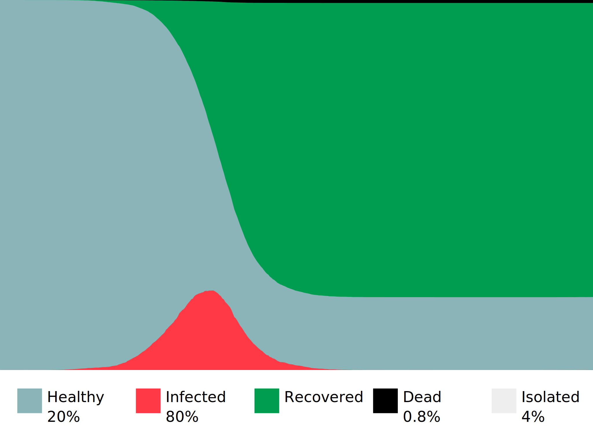

<figcaption>
Simulation results for free movement.
</figcaption>

This results in the curve familiar from mainstream media, and only 20% of the
population remain uninfected by the end of the simulation. As some of the
symptomatic individuals self-isolate, 4% of time is spent in isolation across
the whole population.

If we run the same simulation again but using an Apple/Google-style contact
tracing app, where contacts of those who test positive are notified and
encouraged to self-isolate and get themselves tested, we see:

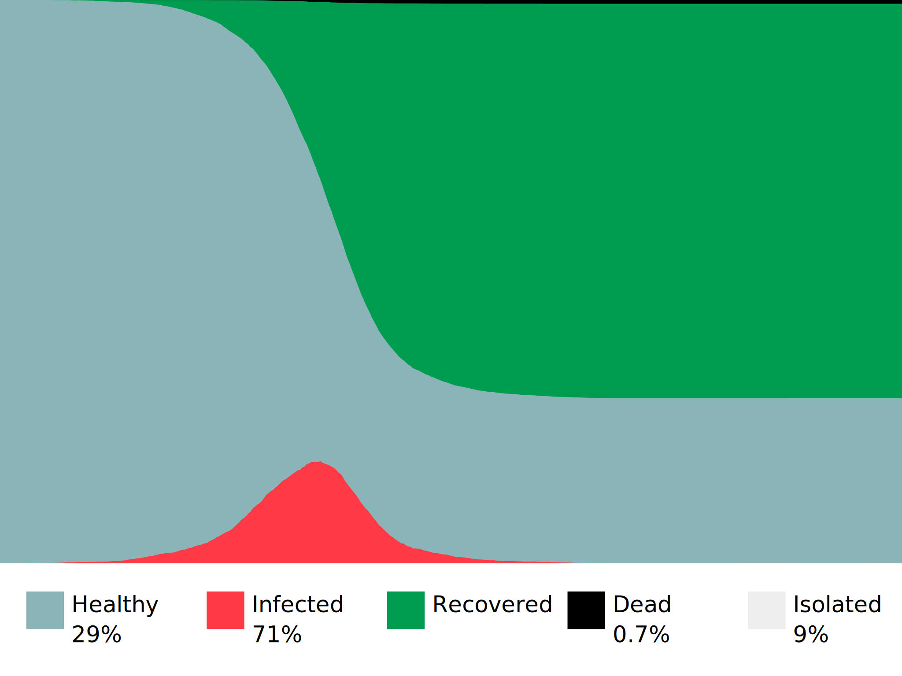

<figcaption>
Simulation results for Apple/Google-style contact tracing.
</figcaption>

Despite being parametrized with two-thirds of the population using the app,
Apple/Google-style contact tracing only managed to keep 29% of the population
healthy. A definite improvement over the baseline, but not as significant as one
might have hoped.

There are three main reasons for this. The first is that despite the two-thirds
adoption, only about 44% of contacts are actually registered — leading to lots
of infectious contacts being missed.

Secondly, due to limited testing capacity and any delays in testing, by the time
immediate contacts get tested, they've already infected others and the system is
always playing "catch-up" to the next generation of infected indiviudals.

And, finally, most of the privacy-preserving contact tracing efforts place an
arbitrary time limit — often 14 days — for notifying contacts. This results in
catching only those who someone might have infected, and often fails to capture
those who might have infected them.

In contrast, running the same simulation again using SafetyScore with two-thirds
adoption stemming from two-thirds of the clusters being safeguarded, results in
a significantly better outcome:

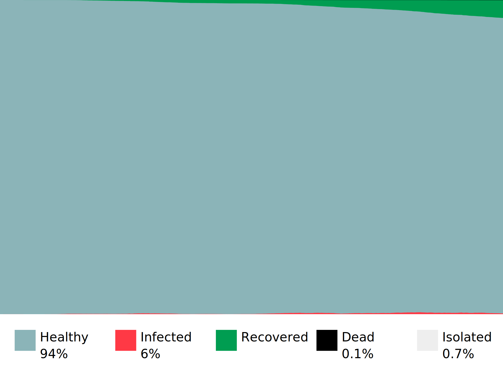

<figcaption>
Simulation results for SafetyScore.
</figcaption>

We see that the epidemic has been successfully contained and 94% of the
population remain uninfected by the end of the simulation. This speaks to the
efficacy of SafetyScore and suggests that there is merit to our approach.

Of particular interest, from looking at the raw data for each day, is that the
number of individuals who are notified by the SafetyScore app to self-isolate
closely tracks the number of infected individuals.

This results in the population spending only 0.7% of the time in isolation. This
seems to be close to optimal and suggests that SafetyScore can keep people safe
while enabling society and economy to function productively.

If we run the same scenario again but use lockdowns as the means of suppression,
we see:

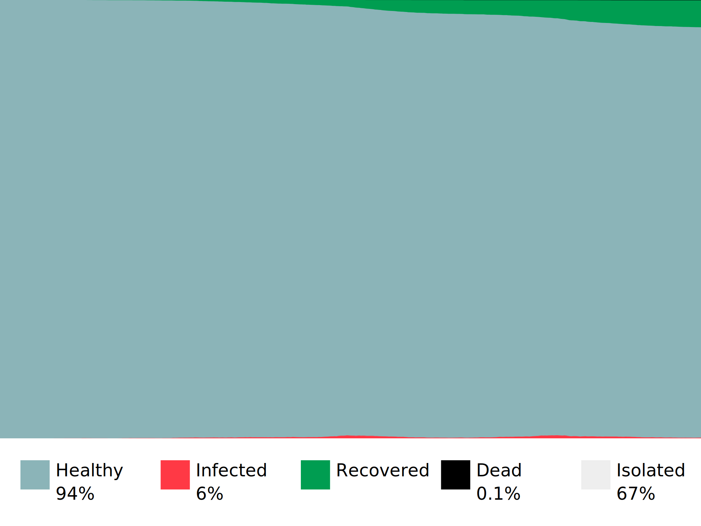

<figcaption>
Simulation results for lockdowns.
</figcaption>

The 94% of the population that remain uninfected at the end of the simulation is
comparable to SafetyScore, but this comes at a high cost of keeping people
isolated for 67% of the time.

This underscores what we all know to be true, that lockdowns keep us safe but
are not sustainable as a long-term solution given their devastating impact on
society and the economy.

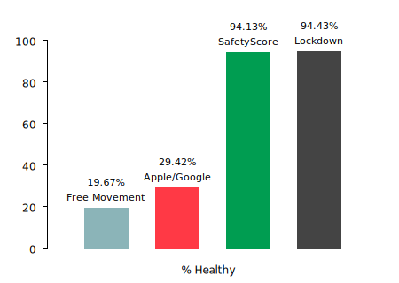

<figcaption>
Comparison of the various simulations for the percentage of the population that
remain uninfected.
</figcaption>

In summary, SafetyScore is able to keep people safe in a manner comparable to
lockdowns, and is three times as effective as Apple/Google-style contact tracing
despite having the same number of users.

SafetyScore is able to achieve this with minimal disruption to society and costs
almost two orders of magnitude less in terms of the percentage of time that
people end up being isolated.

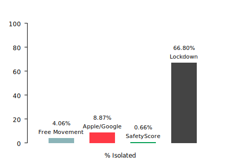

<figcaption>
Comparison of the various simulations for the percentage of time that people are
isolated.
</figcaption>

We fully recognize that no model can perfectly reflect the complexities of the
real world — especially when there are so many unknowns to accurately
parametrize models.

From assumptions around the symptomatic reservoir, to the sensitivity of tests,
the extent to which immunity is affected and long-lasting, transmission both
within and between households, there are so many facets for which data is only
now starting to emerge.

To this end, we are looking to bring together members from the broader open data
and modeling communities to build the necessary datasets and develop richer
models using the best methodologies available.

By combining macroscopic mobility structures [^BH13] with the microscopic
temporal contact structures [^SSL16], along with locale-specific demographic
data, testing/treatment capacity/effectiveness, environmental factors, social
behavior, and commute/hub topologies, we hope to further validate and inform our
approach.

## Conclusions

SafetyScore illustrates that it's possible to do network-level tracing without
compromising on user privacy. This can be used as a key tool in containing
epidemics before a vaccine is readily available.

In contrast to existing first-degree contact tracing efforts, SafetyScore
provides much faster feedback for those at risk, and allows populations to
self-regulate in an unparalleled manner.

Thus SafetyScore offers a viable alternative to lockdowns as a way of containing
both current and future epidemics. Instead of having to choose between saving
lives or livelihoods, we could do both.

And, finally, the open and decentralized nature of the protocol allows it to be
more easily adopted at an international level — letting countries reopen borders
without putting their populations at massive risk.

## Acknowledgements

We thank Krishna Kotecha for validating our approach with prototype code on iOS.
We thank Joerg Baach, Alon Braun, Mamading Ceesay, Josef Davies-Coates, Huy
Dinh, Nina Fefferman, Chance Jiang, Laura Kahn, Anthony Leung, Hinesh Mandalia,
Barney Mannerings, Alex McKinlay, Robert Mighall, Erik Moeller, Ramesh Nair,
Samuele Poletto, Seyi Ogunyemi, William Pritchard, Ray Rafiq, Imtiaz Shams,
David Spergel, Pierre-Antoine Tetard, Daniel Warner, and Yasmin Weaver for
extremely valuable conversations on SafetyScore's design and its philosophy.

## References

[^apache2]: [Apache 2.0 License](https://apache.org/licenses/LICENSE-2.0.txt).

[^apps]: [Unified research on privacy-preserving contact tracing and exposure notification for COVID-19](https://tinyurl.com/research-on-contact-tracing).

[^calibration]: [OpenTrace Calibration](https://github.com/opentrace-community/opentrace-calibration).

[^capnproto-rpc]: [Cap'n Proto RPC Protocol](https://capnproto.org/rpc.html).

[^capnproto]: [Cap'n Proto](https://capnproto.org).

[^flatbuffers]: [FlatBuffers](https://google.github.io/flatbuffers).

[^gact]: [Apple/Google Privacy-Preserving Contact Tracing](https://apple.com/covid19/contacttracing).

[^grpc]: [gRPC Framework](https://grpc.io).

[^protobuf]: [Protocol Buffers](https://developers.google.com/protocol-buffers).

[^safetyscore]: [SafetyScore GitHub Repository](https://github.com/safetyscore/safetyscore).

[^simulation]: [SafetyScore Simulation](https://simulation.safetyscore.app).

[^tcn]: [TCN Protocol](https://github.com/TCNCoalition/TCN).

[^tor]: [Tor Project](https://torproject.org).

[^xkcd]: [XKCD Security](https://xkcd.com/538).

[^Bac02]: Adam Back. [Hashcash - A Denial of Service
Counter-Measure](http://www.hashcash.org/papers/hashcash.pdf). 2002.

[^Ber06]: Daniel J. Bernstein. [Curve25519: new Diffie-Hellman speed
records](https://cr.yp.to/ecdh/curve25519-20060209.pdf). 2006.

[^BAHLE20]: William J. Bradshaw, Ethan C. Alley, Jonathan H. Huggins, Alun L.
Lloyd, and Kevin M. Esvelt. [Bidirectional contact tracing is required for
reliable COVID-19
control](https://www.medrxiv.org/content/10.1101/2020.05.06.20093369v1). 2020.

[^BBB+18]: Benedikt Bünz, Jonathan Bootle, Dan Boneh, Andrew Poelstra, Pieter
Wuille, and Greg Maxwell. [Bulletproofs: Short Proofs for Confidential
Transactions and More](https://eprint.iacr.org/2017/1066.pdf). 2018.

[^BBHR18]: Eli Ben-Sasson, Iddo Bentov, Yinon Horesh, and Michael Riabzev.
[Scalable, transparent, and post-quantum secure computational
integrity](https://eprint.iacr.org/2018/046.pdf). 2018.

[^BCTV13]: Eli Ben-Sasson, Alessandro Chiesa, Eran Tromer, and Madars Virza.
[Succinct Non-Interactive Zero Knowledge for a von Neumann
Architecture](https://eprint.iacr.org/2013/879.pdf). 2013.

[^BDK15]: Alex Biryukov, Daniel Dinu, and Dmitry Khovratovich. [Argon2: the
memory-hard function for password hashing and other
applications](https://cryptolux.org/images/0/06/Argon2-euro.pdf). 2015.

[^BDLSY12]: Daniel J. Bernstein, Niels Duif, Tanja Lange, Peter Schwabe, and
Bo-Yin Yang. [High-speed high-security
signatures](https://ed25519.cr.yp.to/ed25519-20110705.pdf). In *Journal of
Cryptographic Engineering*, 2:77-89, 2012.

[^BDP+18]: Guido Bertoni, Joan Daemen, Michaël Peeters, Gilles Van Assche, Ronny
Van Keer, and Benoît Viguier. [KangarooTwelve: fast hashing based on
Keccak-p](https://keccak.team/files/KangarooTwelve.pdf). 2018.

[^BH13]: Dirk Brockman and Dirk Helbing. [The Hidden Geometry of Complex,
Network-Driven Contagion
Phenomena](http://rocs.hu-berlin.de/papers/brockmann_2013.pdf). In *Science*,
342(6164):1337-1342, 2013.

[^BHH+15]: Daniel J. Bernstein, Daira Hopwood, Andreas Hülsing, Tanja Lange,
Ruben Niederhagen, Louiza Papachristodoulou, Michael Schneider, Peter Schwabe,
and Zooko Wilcox-O’Hearn. [SPHINCS: practical stateless hash-based
signatures](https://www.iacr.org/archive/eurocrypt2015/90560214/90560214.pdf).
In *EUROCRYPT*, volume 9056 of LNCS, pages 368–397, 2015.

[^BHK+19]: Daniel J. Bernstein, Andreas Hülsing, Stefan Kölbl, Ruben
Niederhagen, Joost Rijneveld, and Peter Schwabe. [The sphincs+ signature
framework](https://cryptojedi.org/papers/spx-20190923.pdf). In *CCS*, pages
2129–2146, 2019.

[^BKT+20]: Jason Bay, Joel Kek, Alvin Tan, Chai Sheng Hau, Lai Yongquan, Janice
Tan, and Tang Anh Quy. [BlueTrace: A privacy-preserving protocol for
community-driven contact tracing across
borders](https://bluetrace.io/static/bluetrace_whitepaper-938063656596c104632def383eb33b3c.pdf). 2020.

[^BLS04]: Dan Boneh, Ben Lynn, and Hovav Shacham. [Short Signatures from the
Weil Pairing](https://www.iacr.org/archive/asiacrypt2001/22480516.pdf). In
*Journal of Cryptology*, 17(4):297–319, 2004.

[^BLS19]: Johannes K Becker, David Li, and David Starobinski. [Tracking
Anonymized Bluetooth
Devices](http://people.bu.edu/staro/Tracking_Anonymized_Bluetooth_Devices__PoPETS_Camera_Ready_.pdf).
In *Proceedings of Privacy Enhancing Technologies*, (3):50-65, 2019.

[^BRS20]: Samuel Brack, Leonie Reichert, and Bjorn Scheuermann. [Decentralized
Contact Tracing Using a DHT and Blind
Signatures](https://eprint.iacr.org/2020/398.pdf). 2020.

[^Cha82]: David Chaum. [Blind Signatures for Untraceable
Payments](https://link.springer.com/chapter/10.1007/978-1-4757-0602-4_18). In
*Crypto*, pages 199–203, 1982.

[^Cha82a]: David Chaum. [Computer Systems Established, Maintained, and Trusted
by Mutually Suspicious
Groups](https://www.chaum.com/publications/research_chaum_2.pdf). 1982.

[^Col20]: Robert Coleman. [Defending Against Linkage Attacks in Decentralized
Contact Tracing
Protocols](https://github.com/robertTheHub/ContactTracingSurvey/blob/master/ContactTracing.pdf). 2020.

[^CSWH00]: Ian Clarke, Oskar Sandberg, Brandon Wiley, and Theodore W. Hong.
[Freenet: A Distributed Anonymous Information Storage and Retrieval
System](http://citeseerx.ist.psu.edu/viewdoc/summary?doi=10.1.1.10.4919). In
*Workshop on Design Issues in Anonymity and Unobservability*, pages 311–320,
July 2000.

[^Dou02]: John Douceur. [The Sybil
Attack](https://link.springer.com/chapter/10.1007/3-540-45748-8_24). In *Lecture
Notes in Computer Science*, 2429:251-260, 2002.

[^DH18]: George Danezis and David Hrycyszyn. [Blockmania: from Block DAGs to
Consensus](https://arxiv.org/abs/1809.01620). 2018.

[^ELC15]: Adam Eijdenberg, Ben Laurie, and Al Cutter. [Verifiable Data
Structures](https://github.com/google/trillian/blob/master/docs/papers/VerifiableDataStructures.pdf). 2015.

[^FLN+20]: Neil M Ferguson, Daniel Laydon, Gemma Nedjati-Gilani, Natsuko Imai,
Kylie Ainslie, Marc Baguelin, Sangeeta Bhatia, Adhiratha Boonyasiri, Zulma
Cucunubá, Gina Cuomo-Dannenburg, Amy Dighe, Ilaria Dorigatti, Han Fu, Katy
Gaythorpe, Will Green, Arran Hamlet, Wes Hinsley, Lucy C Okell, Sabine van
Elsland, Hayley Thompson, Robert Verity, Erik Volz, Haowei Wang, Yuanrong Wang,
Patrick GT Walker, Caroline Walters, Peter Winskill, Charles Whittaker, Christl
A Donnelly, Steven Riley, and Azra C Ghani. [Report 9: Impact of
non-pharmaceutical interventions (NPIs) to reduce COVID-19 mortality and
healthcare
demand](https://www.imperial.ac.uk/media/imperial-college/medicine/sph/ide/gida-fellowships/Imperial-College-COVID19-NPI-modelling-16-03-2020.pdf). 2020.

[^FVB+18]: Giulia Fanti, Shaileshh Bojja Venkatakrishnan, Surya Bakshi, Bradley
Denby, Shruti Bhargava, Andrew Miller, and Pramod Viswanath. [Dandelion++:
Lightweight Cryptocurrency Networking with Formal Anonymity
Guarantees](https://arxiv.org/abs/1805.11060). 2018.

[^FWK+20]: Luca Ferretti, Chris Wymant, Michelle Kendall, Lele Zhao, Anel
Nurtay, Lucie Abeler-Dörner, Michael Parker, David Bonsall, and Christophe
Fraser. [Quantifying SARS-CoV-2 transmission suggests epidemic control with
digital contact
tracing](https://science.sciencemag.org/content/368/6491/eabb6936). In
*Science*, March 2020.

[^GLL18]: Shay Gueron, Adam Langley, and Yehuda Lindell. [AES-GCM-SIV:
Specification and Analysis](https://eprint.iacr.org/2017/168.pdf). 2018.

[^GLY+18]: Yilong Geng, Shiyu Liu, Zi Yin, Ashish Naik, Balaji Prabhakar, Mendel
Rosenblum, and Amin Vahdat. [Exploiting a Natural Network Effect for Scalable,
Fine-grained Clock
Synchronization](https://www.usenix.org/system/files/conference/nsdi18/nsdi18-geng.pdf).
In *Proceedings of the 15th USENIX Symposium on Networked Systems Design and
Implementation*, 2018.

[^JF11]: David Jao and Luca De Feo. [Towards quantum-resistant cryptosystems
from supersingular elliptic curve
isogenies](https://link.springer.com/chapter/10.1007/978-3-642-25405-5_2). In
*Post-Quantum Cryptography — 4th International Workshop*, PQCrypto, 2011.

[^KTLG20]: Stephen Kissler, Christine Tedijanto, Marc Lipsitch, and Yonatan
Grad. [Social distancing strategies for curbing the COVID-19
epidemic](https://dash.harvard.edu/handle/1/42638988). 2020.

[^LSP82]: Leslie Lamport, Robert Shostak, and Marshall Pease. [The Byzantine
Generals Problem](https://dl.acm.org/doi/10.1145/357172.357176). In *ACM
Transactions on Programming Languages and Systems*, 4(3):387–389, 1982.

[^Lev04]: Raph Levien. [Attack Resistant Trust
Metrics](http://citeseerx.ist.psu.edu/viewdoc/summary?doi=10.1.1.83.9266). 2004.

[^MLF20]: Kellen Myers, Eric Lofgren, and Nina Fefferman. The Ω-test for
certainty in Monte Carlo simulations. In review. 2020.

[^MLL20]: Aanchal Malhotra, Adam Langley, and Watson Ladd.
[Roughtime](https://tools.ietf.org/html/draft-ietf-ntp-roughtime-01). 2020.

[^Nak08]: Satoshi Nakomoto. [Bitcoin: A Peer-to-Peer Electronic Cash
System](https://bitcoin.org/bitcoin.pdf). 2008.

[^OANW20]: Jack O’Connor, Jean-Philippe Aumasson, Samuel Neves, and Zooko
Wilcox-O’Hearn. [BLAKE3: One Function, Fast
Everywhere](https://github.com/BLAKE3-team/BLAKE3-specs/blob/master/blake3.pdf). 2020.

[^Per16]: Trevor Perrin. [The XEdDSA and VXEdDSA Signature
Schemes](https://signal.org/docs/specifications/xeddsa/). 2016.

[^Per18]: Trevor Perrin. [The Noise Protocol
Framework](https://noiseprotocol.org/noise.html). 2018.

[^PHEMD17]: Ania Piotrowska, Jamie Hayes, Tariq Elahi, Sebastian Meiser, and
George Danezis. [The Loopix Anonymity System](https://arxiv.org/abs/1703.00536). 2017.

[^RCC+20]: Ronald L. Rivest, Jon Callas, Ran Canetti, Kevin Esvelt, Daniel Kahn
Gillmor, Yael Tauman Kalai, Anna Lysyanskaya, Adam Norige, Ramesh Raskar, Adi
Shamir,, Emily Shen, Israel Soibelman, Michael Specter, Vanessa Teague, Ari
Trachtenberg, Mayank Varia, Marc Viera, Daniel Weitzner, John Wilkinson, and
Marc Zissman. [The PACT protocol
specification](https://pact.mit.edu/wp-content/uploads/2020/04/The-PACT-protocol-specification-ver-0.1.pdf). 2020.

[^RSB+20]: Ramesh Raskar,  Isabel Schunemann, Rachel Barbar, Kristen Vilcans,
Jim Gray, Praneeth Vepakomma, Suraj Kapa, Andrea Nuzzo, Rajiv Gupta, Alex Berke,
Dazza Greenwood, Christian Keegan, Shriank Kanaparti, Robson Beaudry, David
Stansbury, Beatriz Botero Arcila, Rishank Kanaparti, Vitor Pamplona, Francesco M
Benedetti, Alina Clough, Riddhiman Das, Kaushal Jain, Khahlil Louisy, Greg
Nadeau, Vitor Pamplona, Steve Penrod, Yasaman Rajaee, Abhishek Singh, Greg
Storm, and John Werner. [Apps Gone Rogue: Maintaining Personal Privacy in an
Epidemic](https://arxiv.org/abs/2003.08567). 2020.

[^SABMD18]: Alberto Sonnino, Mustafa Al-Bassam, Shehar Bano, Sarah Meiklejohn,
and George Danezis. [Coconut: Threshold Issuance Selective Disclosure
Credentials with Applications to Distributed
Ledgers](https://arxiv.org/abs/1802.07344). 2018.

[^SSL16]: Vedran Sekara, Arkadiusz Stopczynski, and Sune Lehmann. [Fundamental
structures of dynamic social
networks](https://www.pnas.org/content/113/36/9977). In *Proceedings of the
National Academy of Sciences*, 113(36):9977-9982, 2016.

[^TPH+20]: Carmela Troncoso, Mathias Payer, Jean-Pierre Hubaux, Marcel Salathé,
James Larus, Edouard Bugnion, Wouter Lueks, Theresa Stadler, Apostolos Pyrgelis,
Daniele Antonioli, Ludovic Barman, Sylvain Chatel, Kenneth Paterson, Srdjan
Čapkun, David Basin, Jan Beutel, Dennis Jackson, Bart Preneel, Nigel Smart, Dave
Singelee, Aysajan Abidin, Seda Guerses, Michael Veale, Cas Cremers, Reuben
Binns, and Ciro Cattuto. [Decentralized Privacy-Preserving Proximity
Tracing](https://github.com/DP-3T/documents/blob/master/DP3T%20White%20Paper.pdf). 2020.

[^Vau20]: Serge Vaudenay. [Analysis of DP3T: Between Scylla and
Charybdis](https://eprint.iacr.org/2020/399.pdf). 2020.

[^WT99]: Alma Whitten and J. D. Tygar. [Why Johnny Can't Encrypt: A Usability
Evaluation of PGP
5.0](https://www.usenix.org/conference/8th-usenix-security-symposium/why-johnny-cant-encrypt-usability-evaluation-pgp-50).
In *Proceedings of the 8th USENIX Security Symposium*, pages 169-184, 1999.
